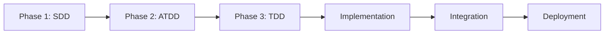
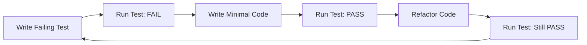

<!--
================================================================================
CONSTITUTION SYNC IMPACT REPORT
Version: 0.4.0 → 0.5.0
Date: 2026-02-19
================================================================================

VERSION CHANGE:
  Old: 0.4.0 (Pre-Release)
  New: 0.5.0 (Pre-Release)
  Bump Rationale: Added mandatory Faker-js generated test data policy for integration/E2E edge-case coverage

MODIFIED SECTIONS (v0.5.0):
  - Section VII: Testing Requirements
    * Added "Test Data Generation Standards (ATDD + Integration/E2E)"
    * Mandated `@faker-js/faker` for integration and E2E test data generation
    * Required extreme/boundary test scenarios (high volume, long strings, special characters)
    * Added reproducibility guidance (deterministic seeds for CI stability)

IMPACT ASSESSMENT (v0.5.0):
  - BREAKING: No
  - REQUIRES ACTION: Yes
    * Integration/E2E tests must migrate to Faker-generated datasets
    * Acceptance test documentation must include Faker edge-case coverage evidence
  - TEMPLATES AFFECTED:
    * tasks-template.md: Should include Faker-based edge-case test tasks
    * plan-template.md: Should include Faker strategy in ATDD planning
    * spec-template.md: Should include explicit boundary/extreme acceptance criteria

PREVIOUS CHANGES (v0.4.0 - 2026-02-19):
  Old: 0.3.0 (Pre-Release)
  New: 0.4.0 (Pre-Release)
  Bump Rationale: MAJOR REWRITE - Formalized three-phase development methodology (SDD → ATDD → TDD)

MODIFIED SECTIONS (v0.4.0):
  - Section VI: Development Workflow (COMPLETE REWRITE)
    * Three-phase mandatory workflow: Spec-Driven → Acceptance Test-Driven → Test-Driven
    * Phase gates with explicit entry/exit criteria
    * Best practices for each phase
    * Integration guidance between phases
    * Example workflows and anti-patterns
  - Section VII: Testing Requirements (EXPANDED)
    * Integrated ATDD as Phase 2 requirement
    * Clarified testing pyramid with phase mapping
    * Added ATDD best practices and tools
    * Clear distinction between acceptance tests (ATDD) and unit tests (TDD)

IMPACT ASSESSMENT (v0.4.0):
  - BREAKING: Yes - changes workflow significantly, requires all features follow three-phase approach
  - REQUIRES ACTION: Immediate
    * All new features MUST follow SDD → ATDD → TDD workflow
    * Acceptance tests now mandatory before implementation
    * Cannot skip phases or reorder them
    * Tasks template must reflect three-phase structure
  - TEMPLATES AFFECTED:
    * tasks-template.md: Must organize by three phases
    * spec-template.md: Must include acceptance criteria suitable for ATDD
    * plan-template.md: Must include ATDD phase planning

PREVIOUS CHANGES (v0.3.0 - 2026-02-19):
  Old: 0.2.0 (Pre-Release)
  New: 0.3.0 (Pre-Release)
  Bump Rationale: CRITICAL FIX - Added mandatory TDD enforcement to Section VII to prevent test deferral

MODIFIED SECTIONS (v0.3.0):
  - Section VII: Testing Requirements
    * Added "Test-Driven Development (TDD) Enforcement" subsection
    * Tests MUST be written BEFORE implementation (TDD approach)
    * All Zod schemas MUST have unit tests (validation, helpers, edge cases)
    * Tests CANNOT be deferred to "post-MVP" or "polish" phases
    * PR approval BLOCKED without tests
    * Explicit schema testing requirements added

IMPACT ASSESSMENT (v0.3.0):
  - BREAKING: Yes - changes workflow, tests now required before implementation
  - REQUIRES ACTION: Immediate
    * All future features must include tests in Phase 2 (Foundational)
    * Existing features without schema tests need remediation
    * PR review checklist must include test coverage verification
  - TEMPLATES AFFECTED:
    * tasks-template.md: Tests changed from OPTIONAL to MANDATORY
    * tasks-template.md: Added Phase 2 foundational test requirements
    * tasks-template.md: Added gate check for test completion before user stories
    * tasks-template.md: Made TDD approach explicit in all user story phases

ROOT CAUSE ADDRESSED:
  This change fixes a critical gap that allowed ID validation bug to reach production.
  Previous template allowed tests to be marked "OPTIONAL" and deferred "post-MVP",
  violating Constitution Section VII requirement for 80% coverage.

PREVIOUS CHANGES (v0.2.0 - 2026-02-19):
  Old: 0.1.0 (Pre-Release)
  New: 0.2.0 (Pre-Release)
  Bump Rationale: Added Section XII - Dependency Management & Version Currency requirements

MODIFIED SECTIONS (v0.2.0):
  - NEW Section XII: Dependency Management & Version Currency
    * Major dependencies must use latest stable versions
    * Dependencies must be upgraded within 30 days of major releases
    * Security patches applied immediately
    * User stories required for major version upgrades
    * Dependency audit required monthly

IMPACT ASSESSMENT (v0.2.0):
  - BREAKING: No
  - REQUIRES ACTION: Yes
    * Immediate audit of all dependencies for latest versions
    * Create user stories for outdated major dependencies
    * Establish monthly dependency review process
  - TEMPLATES AFFECTED:
    * spec-template.md: Add dependency version verification section
    * tasks-template.md: Add dependency upgrade tasks category

PREVIOUS CHANGES (v0.1.0 - 2026-02-19):
  Old: 0.0.1 (Pre-Release)
  New: 0.1.0 (Pre-Release)
  Bump Rationale: Added Acceptance Testing & Playwright Screenshot Documentation requirements to Section VII

MODIFIED SECTIONS (v0.1.0):
  - Section VII: Testing Requirements
    * Added "Acceptance Testing & Documentation" subsection
    * Mandatory Playwright screenshot documentation for all E2E tests
    * User story testing must include visual proof of acceptance criteria
    * Test evidence storage and linking requirements
    * Enhanced rationale to include visual evidence for stakeholders

IMPACT ASSESSMENT (v0.1.0):
  - BREAKING: No
  - REQUIRES ACTION: Yes
    * All future E2E tests must capture and store screenshots
    * Existing acceptance test documentation should be updated with screenshot evidence
    * PR templates should include screenshot evidence checklist
  - TEMPLATES AFFECTED:
    * tasks-template.md: Add screenshot capture tasks for E2E tests
    * spec-template.md: Add acceptance test documentation section requirement

PREVIOUS CHANGES (v0.0.1 - 2026-02-18):
  Old: Template placeholders
  New: 0.0.1 (Pre-Release)
  Bump Rationale: Initial formalized constitution for Hunt Board NPM Library

MODIFIED PRINCIPLES:
  - All template placeholders replaced with concrete governance principles

ADDED SECTIONS:
  1. I. Spec-Driven Design (NON-NEGOTIABLE)
  2. II. Component-First Architecture (React + Material UI)
  3. III. Screaming Architecture & Vertical Slice Architecture
  4. IV. Data Configuration Management
  5. V. Storybook-Driven Component Development
  6. VI. Development Workflow (Spec-Driven)
  7. VII. Testing Requirements
  8. VIII. Guiding Philosophy
  9. IX. Governance
  10. X. Runtime Guidance
  11. XI. NPM Library Requirements (Hunt Board Module)

REMOVED SECTIONS:
  - Generic template placeholders ([PROJECT_NAME], [PRINCIPLE_X_NAME], etc.)

TEMPLATES REQUIRING UPDATES:
  ⚠ .specify/templates/plan-template.md
     - Constitution Check section should reference specific principles:
       * Spec-Driven Design (Section I)
       * Component architecture levels check (Section II)
       * Vertical slice architecture (Section III)
       * Storybook requirements (Section V)
     - Project Structure should emphasize vertical slicing
     - Technical Context should include: React version, Material UI version,
       Storybook version, component architecture level

  ⚠ .specify/templates/spec-template.md
     - Add mandatory section: "Component Architecture" for UI features
       * Level (Atom/Organism/Page)
       * Material UI components used
       * Responsive behavior requirements
     - Add mandatory section: "Storybook Story Requirements"
       * Required stories (default, edge cases, states)
       * Accessibility requirements (a11y addon)
       * Interactive controls needed
     - Add mandatory section: "Accessibility Requirements" (referenced in Section I)

  ⚠ .specify/templates/tasks-template.md
     - Add standard task category: "Storybook Stories"
       * Story creation task for each component
       * A11y test tasks
       * Interaction test tasks
     - Emphasize 80% coverage minimum from Section VII
     - Include Material UI implementation tasks
     - Organize by vertical slices (align with Section III)
     - Add task category: "Acceptance Test Documentation" (NEW in v0.1.0)
       * Playwright screenshot capture tasks
       * Screenshot evidence linking tasks
       * Acceptance criteria validation tasks

FOLLOW-UP TODOS:
  1. Update plan-template.md with Hunt Board-specific constitution checks
  2. Update spec-template.md with Storybook and accessibility sections
  3. Update tasks-template.md with Storybook story tasks as standard
  4. Create quick reference guide for three-level atomic design constraint
  5. Update spec-template.md to include "Acceptance Test Documentation" section (NEW in v0.1.0)
  6. Update tasks-template.md to include Playwright screenshot tasks (NEW in v0.1.0)
  7. Create PR template checklist for screenshot evidence (NEW in v0.1.0)

FILES FLAGGED FOR MANUAL FOLLOW-UP:
  - All three template files require updates to align with constitution
  - Updates should be made before next feature specification
  - spec-template.md: Add acceptance test documentation requirements (v0.1.0)
  - tasks-template.md: Add screenshot capture and evidence tasks (v0.1.0)

VALIDATION STATUS:
  ✅ No unexplained bracket tokens remaining
  ✅ Version line matches report (0.5.0)
  ✅ Dates in ISO format (YYYY-MM-DD)
  ✅ Principles are declarative and testable
  ✅ Pre-release versioning policy defined in Section IX

================================================================================
-->

# JobHunter07 — Hunt Board NPM Library
## Engineering Constitution
**Version:** 0.5.0
**Status:** Pre-Release
**Ratified:** 2026-02-12
**Last Amended:** 2026-02-19

This constitution governs all engineering work for the Hunt Board NPM Library and any related modules.
It supersedes all other conventions, defaults, or framework opinions.
All contributors — human or AI — must comply.

---

# I. Spec-Driven Design (NON-NEGOTIABLE)

**Nothing is coded until it is fully specified, reviewed, and approved.**

### Requirements
- Every feature MUST have a specification before implementation begins.
- Specifications define:
  - Purpose and scope
  - Inputs, outputs, and state transitions
  - User interactions and UX flows
  - Error conditions and recovery behavior
  - Accessibility requirements
  - Storybook requirements
- Specs must be small, clear, testable, and atomic.
- No pull request is accepted without referencing its approved specification.

**Rationale:** Prevents rework, ensures alignment, enables parallel work, and creates living documentation.

---

# II. Component-First Architecture (React + Material UI)

Every UI element is a component, built bottom-up using **Atomic Design with exactly three levels**:

### Allowed Levels
- **Atoms** — Buttons, inputs, labels, icons, typography, layout primitives
- **Organisms** — Cards, forms, lists, navigation bars, composite UI
- **Pages** — Full screens composed of organisms and atoms

### Rules
- No Molecules. No exceptions.
- Every component MUST have:
  - A specification
  - A Storybook story
  - Responsive behavior by default
  - Material UI styling and theming
- Components must be reusable, composable, predictable, and consistent.

**Rationale:** Simplicity through constraint. Three levels prevent over-engineering while maintaining composability.

---

# III. Screaming Architecture & Vertical Slice Architecture

The folder layout must make use-cases obvious at a glance.

### Rules
- Features are organized by **vertical slices**, not technical layers.
- Each slice contains:
  - UI components
  - Server actions (if applicable)
  - Validation
  - Data access
  - Tests
  - Storybook stories
  - Documentation
- Vertical slices are self-contained and independently deployable.
- No cross-slice coupling except through explicitly defined interfaces.
- Shared utilities live in `/src/lib` and must be stable, documented, and versioned.

**Rationale:** Makes intent obvious, reduces coupling, and enables modular NPM packaging.

---

# IV. Data Configuration Management

All data schemas, validation, and types must come from a **single source of truth**.

### Rules
- All domain models defined in schema files (Zod preferred).
- Types are generated from schemas — never hand-written.
- All data access goes through typed, validated interfaces.
- API contracts must be strongly typed (tRPC or Zod).
- Database schema migrations must be versioned and reversible.

**Rationale:** Prevents drift between frontend, backend, and database. Enables safe refactoring.

---

# V. Storybook-Driven Component Development

Every component MUST have a Storybook story.

### Story Requirements
- Stories live in `src/stories`
- File name matches the component (`Button.stories.tsx`)
- Use CSF3 with autodocs
- Include:
  - Default state
  - Edge cases (empty, loading, error, disabled, max content)
  - Accessibility checks (`@storybook/addon-a11y`)
  - Interactive controls for props
  - Interaction tests where applicable
- Stories use relative imports from the component directory.

**Rationale:** Storybook is living documentation, visual testing, and an isolated development environment.

---

# VI. Development Workflow (Three-Phase Methodology)

**MANDATORY WORKFLOW ORDER:** Every feature MUST follow these three phases in sequence.



**Golden Rule:** Specification → Acceptance Tests → Unit Tests → Implementation

---

## Phase 1: Spec-Driven Design (SDD)

**Purpose:** Define WHAT to build and WHY before any code or tests are written.

**Audience:** Product Managers, Stakeholders, Users, Developers

### Entry Criteria
- Feature request or user need identified
- Business value articulated
- Success metrics defined

### Activities
1. **Write Feature Specification** (in `/specs/[###-feature-name]/spec.md`)
   - User stories with priorities (P1, P2, P3...)
   - Acceptance criteria in Given/When/Then format
   - Functional requirements (FR-001, FR-002...)
   - Key entities and data models
   - Component architecture (if UI: Atoms/Organisms/Pages)
   - Accessibility requirements (WCAG AA)
   - Storybook story requirements (if UI)
   - Edge cases and error scenarios

2. **Review & Approval**
   - stakeholders review for business alignment
   - Technical team reviews for feasibility
   - Identify gaps, ambiguities, missing requirements
   - Revise until specification is complete and unambiguous

3. **Create Implementation Plan** (in `/specs/[###-feature-name]/plan.md`)
   - Technical approach and architecture
   - Dependencies and integration points
   - Performance goals and constraints
   - Security considerations
   - Data model design
   - Component hierarchy (if UI)

### Deliverables
- ✅ Approved `spec.md` with user stories and acceptance criteria
- ✅ Approved `plan.md` with technical design
- ✅ Constitutional compliance check passed
- ✅ Acceptance criteria testable and measurable

### Exit Criteria (Gate to Phase 2)
- [ ] Specification approved by stakeholders
- [ ] All acceptance criteria are testable (Given/When/Then format)
- [ ] Technical design reviewed and approved
- [ ] No open questions or ambiguities remain
- [ ] Constitutional requirements verified (Section I checklist)

### Best Practices
✅ **DO:**
- Write user stories from user perspective ("As a [role], I want [goal]...")
- Make acceptance criteria specific, measurable, achievable
- Prioritize stories (P1 = MVP, P2+ = enhancements)
- Include negative test cases ("What if user does X wrong?")
- Define error messages and edge cases upfront
- Consider accessibility from the start

❌ **DON'T:**
- Skip specification to "save time" (creates rework later)
- Write implementation details in spec (focus on behavior, not code)
- Assume everyone understands implicit requirements (be explicit)
- Approve spec with unresolved questions
- Write tests before spec is approved (risk building wrong thing)

### Anti-Patterns to Avoid
- 🚫 "Let's just start coding and figure it out"
- 🚫 Vague acceptance criteria ("Should work well")
- 🚫 Missing edge cases and error scenarios
- 🚫 Technical implementation leaking into spec

---

## Phase 2: Acceptance Test-Driven Design (ATDD)

**Purpose:** Define HOW to verify success by writing executable acceptance tests BEFORE implementation.

**Audience:** QA Engineers, Developers, Product Managers

### Entry Criteria
- ✅ Phase 1 complete (spec approved)
- ✅ Acceptance criteria are testable
- ✅ Test environment/framework configured

### Activities
1. **Write Acceptance Tests** (in `e2e/[feature].spec.ts` or `tests/integration/[feature].test.ts`)
   - **One test per acceptance criterion** from spec.md
   - Tests written in Given/When/Then format
   - Tests MUST fail initially (red phase)
   - Focus on user behavior, not implementation details
   - Cover happy path, edge cases, and error scenarios

2. **Review Acceptance Tests**
   - Product Manager confirms tests match acceptance criteria
   - Developers confirm tests are implementable
   - QA confirms tests are comprehensive
   - Run tests → verify they all fail (red phase)

3. **Document Test Evidence Requirements**
   - Define what screenshots/artifacts prove acceptance
   - Identify test data needed
   - Plan test environment setup

### Test Types in ATDD Phase
- **End-to-End (E2E) Tests:** Full user journeys (Playwright, Cypress)
- **Integration Tests:** Multi-component interactions, API flows
- **User Acceptance Tests (UAT):** Stakeholder validation scenarios

### Deliverables
- ✅ Acceptance tests written for ALL acceptance criteria
- ✅ All acceptance tests currently FAILING (red phase)
- ✅ Test evidence plan (screenshots, artifacts)
- ✅ Test data fixtures prepared

### Exit Criteria (Gate to Phase 3)
- [ ] Every acceptance criterion has corresponding test
- [ ] All acceptance tests run and fail (prove they can detect issues)
- [ ] Tests are readable and maintainable
- [ ] Product Manager reviewed and approved tests
- [ ] Test framework configured (Playwright/Cypress/etc.)

### Best Practices
✅ **DO:**
- Write tests at the user interface level (click, type, navigate)
- Use testing library selectors that match user intent (`getByRole`, `getByLabel`)
- Include console error detection (catch runtime errors)
- Test data persistence (reload page, verify data still there)
- Capture screenshots on failure for debugging
- Write descriptive test names matching acceptance criteria
- Test one acceptance criterion per test (focused tests)

❌ **DON'T:**
- Write unit tests in this phase (ATDD = integration/E2E only)
- Test implementation details (internal state, private methods)
- Skip negative test cases (error handling is critical)
- Make tests dependent on each other (isolated tests)
- Hard-code test data (use fixtures/factories)

### Example ATDD Test Structure

```typescript
// e2e/kanban-board.spec.ts

test('User Story 1: Create new job target', async ({ page }) => {
  // GIVEN: User is on the Kanban board
  await page.goto('/');
  await expect(page.getByRole('heading', { name: 'Hunt Board' })).toBeVisible();
  
  // WHEN: User clicks Add button and fills form
  await page.getByRole('button', { name: 'Add Target' }).first().click();
  await page.getByLabel(/company/i).fill('Acme Corporation');
  await page.getByRole('button', { name: 'Create Target' }).click();
  
  // THEN: Card appears on board and persists
  await expect(page.getByText('Acme Corporation')).toBeVisible();
  
  // Verify persistence
  await page.reload();
  await expect(page.getByText('Acme Corporation')).toBeVisible();
});
```

### Anti-Patterns to Avoid
- 🚫 Writing tests after implementation (defeats purpose)
- 🚫 Tests that pass without implementation (false positive)
- 🚫 Testing implementation instead of behavior
- 🚫 Skipping error scenarios ("we'll add those later")

---

## Phase 3: Test-Driven Design (TDD)

**Purpose:** Define HOW to build it correctly by writing unit tests BEFORE implementation code.

**Audience:** Developers

### Entry Criteria
- ✅ Phase 2 complete (acceptance tests failing)
- ✅ Technical design from plan.md approved
- ✅ Zod schemas defined (if data feature)

### Activities
1. **Red Phase: Write Failing Unit Tests**
   - **Schema tests** (in `src/features/[feature]/validation/[schema].test.ts`)
     - Test valid data passes validation
     - Test invalid data rejected with proper errors
     - Test helper functions (e.g., `createJobTarget`)
     - Test edge cases (boundary values, special characters)
   - **Logic tests** (in `tests/unit/[feature]/[module].test.ts`)
     - Test pure functions, calculations, transformations
     - Test business logic in isolation
     - Test utility functions
   - **Hook tests** (in `tests/unit/[feature]/hooks/[hook].test.ts`)
     - Test React hooks with `@testing-library/react-hooks`
     - Test state management logic
   - Run tests → verify they FAIL

2. **Green Phase: Implement to Pass Tests**
   - Write minimal code to make tests pass
   - Implement Zod schemas
   - Implement business logic
   - Run tests → verify they PASS
   - Do NOT add features not covered by tests

3. **Refactor Phase: Improve Code Quality**
   - Refactor for readability, performance, maintainability
   - Extract duplicated code
   - Improve naming
   - Tests remain passing throughout refactoring

4. **Component Tests** (if UI feature)
   - Test component rendering with React Testing Library
   - Test user interactions (click, type, submit)
   - Test accessibility (ARIA labels, keyboard navigation)
   - Test edge cases (empty state, loading, error)

### Test Types in TDD Phase
- **Unit Tests:** Pure functions, validation, calculations (Vitest, Jest)
- **Component Tests:** React components in isolation (React Testing Library)
- **Hook Tests:** React hooks (RTL hooks)

### Deliverables
- ✅ Unit tests for all schemas, helpers, business logic
- ✅ Component tests for all UI components
- ✅ All tests passing (green phase)
- ✅ Code coverage ≥ 80% (100% for security-critical)
- ✅ Acceptance tests from Phase 2 now PASSING

### Exit Criteria (Gate to Implementation Phase)
- [ ] All unit tests passing
- [ ] All component tests passing
- [ ] Code coverage meets constitutional requirements (≥80%)
- [ ] Acceptance tests from Phase 2 now passing
- [ ] No failing tests
- [ ] Code reviewed for quality

### Best Practices
✅ **DO:**
- Write test first, see it fail, then write code (Red-Green-Refactor)
- Test one thing per test (focused, isolated tests)
- Use descriptive test names ("should generate valid ID with jt_ prefix")
- Test edge cases and error conditions
- Mock external dependencies (localStorage, API calls)
- Run tests frequently (every few minutes)
- Commit when tests pass (safe checkpoint)

❌ **DON'T:**
- Write implementation before tests (defeats TDD purpose)
- Skip refactor phase (leads to technical debt)
- Test implementation details (test behavior, not internals)
- Write tests that depend on execution order
- Ignore failing tests (fix immediately or remove test)
- Mock too much (unit tests should test real logic)

### Example TDD Test Structure

```typescript
// src/features/kanban-board/validation/jobTarget.schema.test.ts

describe('createJobTarget', () => {
  it('should generate valid ID matching schema pattern', () => {
    // RED: Write test first (will fail - function doesn't exist yet)
    const target = createJobTarget('Test Company');
    
    // Validate against schema
    const result = JobTargetSchema.safeParse(target);
    expect(result.success).toBe(true);
    
    // Validate ID format explicitly
    expect(target.id).toMatch(/^jt_[a-zA-Z0-9_]+$/);
  });
});

// GREEN: Now implement createJobTarget to make test pass
// REFACTOR: Clean up implementation while tests remain green
```

### TDD Cycle (Red-Green-Refactor)



### Anti-Patterns to Avoid
- 🚫 Writing all tests before any implementation (too much context switching)
- 🚫 Skipping the "Red" phase (how do you know test can fail?)
- 🚫 Over-testing trivial code (getters/setters)
- 🚫 Under-testing complex logic (algorithms, validation)
- 🚫 Tests that don't fail when they should (false security)

---

## Phase Integration: How the Three Phases Work Together

### Phase Progression Example

**Scenario:** Adding a "Create Job Target" feature

**Phase 1 (SDD):** Write spec.md
```markdown
User Story: As a job hunter, I want to create new job targets
Acceptance Criteria:
- GIVEN I am on the Kanban board
- WHEN I click Add button and enter company name
- THEN a new card appears with valid ID format (jt_timestamp_random)
```

**Phase 2 (ATDD):** Write acceptance test (e2e/kanban.spec.ts)
```typescript
test('should create new job target', async ({ page }) => {
  await page.goto('/');
  await page.getByRole('button', { name: 'Add Target' }).click();
  await page.getByLabel(/company/i).fill('Acme Corp');
  await page.getByRole('button', { name: 'Create' }).click();
  
  await expect(page.getByText('Acme Corp')).toBeVisible();
  await page.reload();
  await expect(page.getByText('Acme Corp')).toBeVisible(); // Persistence
});
// Test FAILS - feature doesn't exist yet ✅
```

**Phase 3 (TDD):** Write unit tests, then implement
```typescript
// Unit test for ID generation
it('should generate valid ID', () => {
  const target = createJobTarget('Company');
  expect(target.id).toMatch(/^jt_[a-zA-Z0-9_]+$/);
});
// Test FAILS - function doesn't exist ✅

// Implement createJobTarget
export const createJobTarget = (company: string) => {
  const id = `jt_${Date.now()}_${Math.random().toString(36).substring(2, 9)}`;
  // ... implementation
};
// Test PASSES ✅
// Acceptance test PASSES ✅
```

### Quality Gates Between Phases

| Phase | Entry Gate | Exit Gate |
|-------|-----------|----------|
| **Phase 1: SDD** | Feature request approved | Spec approved, testable acceptance criteria defined |
| **Phase 2: ATDD** | Testable acceptance criteria exist | All acceptance tests written and failing |
| **Phase 3: TDD** | Acceptance tests failing | All tests passing, coverage ≥80% |
| **Implementation** | Tests ready | Feature complete, tests passing |
| **Deployment** | Feature complete | Acceptance tests passing, stakeholder approval |

### When to Use Each Test Type

| Test Type | Phase | Purpose | Tool |
|-----------|-------|---------|------|
| **E2E Tests** | ATDD (Phase 2) | Validate user journeys | Playwright |
| **Integration Tests** | ATDD (Phase 2) | Validate component interactions | Vitest/RTL |
| **Unit Tests** | TDD (Phase 3) | Validate logic, schemas, helpers | Vitest |
| **Component Tests** | TDD (Phase 3) | Validate UI components | RTL |
| **Visual Regression** | After TDD | Validate UI appearance | Chromatic |
| **Accessibility Tests** | ATDD + TDD | Validate WCAG compliance | axe, Storybook a11y |

### Task Breakdown Alignment

Tasks in `tasks.md` MUST align with three-phase workflow:

```markdown
## Phase 1: Spec-Driven Design
- [ ] T001 Write feature specification (spec.md)
- [ ] T002 Review and approve specification
- [ ] T003 Create implementation plan (plan.md)

## Phase 2: Acceptance Test-Driven Design
- [ ] T004 Write acceptance tests for User Story 1
- [ ] T005 Write acceptance tests for User Story 2
- [ ] T006 Verify all acceptance tests fail (red phase)

## Phase 3: Test-Driven Design
- [ ] T007 Write unit tests for JobTarget schema
- [ ] T008 Implement JobTarget schema (make tests pass)
- [ ] T009 Write component tests for AddTargetModal
- [ ] T010 Implement AddTargetModal (make tests pass)
- [ ] T011 Verify acceptance tests now pass

## Phase 4: Polish & Integration
- [ ] T012 Write Storybook stories
- [ ] T013 Accessibility audit
- [ ] T014 Performance optimization
```

**Rationale:** Three-phase methodology ensures specification clarity, behavioral validation, and implementation correctness. Prevents building the wrong thing (SDD), building it wrong (ATDD), and building it poorly (TDD).

---

# VII. Testing Requirements

**Testing is integrated into the three-phase workflow (Section VI).**

### Testing Pyramid & Phase Mapping

```
         /\           Phase 3 (TDD)
        /  \          Component Tests
       /____\         
      /      \        Phase 3 (TDD)
     /  Unit  \       Unit Tests (80%+ coverage)
    /__________\      
   /            \     Phase 2 (ATDD)
  /  Integration \    Integration Tests
 /________________\   
/                  \  Phase 2 (ATDD)
/   E2E / Accept   \  Acceptance Tests
/____________________\ 
```

### Test Types by Phase

**Phase 2: ATDD (Acceptance Test-Driven Design)**
- **End-to-End (E2E) Tests:** User journeys, critical flows (Playwright, Cypress)
- **Integration Tests:** Multi-component interactions, API flows, data persistence
- **User Acceptance Tests (UAT):** Stakeholder validation scenarios
- **Purpose:** Validate the system behaves correctly from user perspective

**Phase 3: TDD (Test-Driven Design)**
- **Unit Tests:** Pure functions, validation logic, schemas, helpers (Vitest, Jest)
- **Component Tests:** React components in isolation (React Testing Library)
- **Hook Tests:** React hooks testing (`@testing-library/react-hooks`)
- **Purpose:** Validate individual units work correctly in isolation

**Ongoing (Throughout Development)**
- **Visual Regression Tests:** UI appearance and styling (Storybook + Chromatic/Percy)
- **Accessibility Tests:** WCAG compliance (axe, @storybook/addon-a11y)
- **Performance Tests:** Load time, rendering speed, memory usage

### Coverage Standards
- Minimum **80%** coverage for logic (excluding types/config)
- **100%** coverage for security-critical paths (auth, billing, data access)
- Coverage measured on **unit tests only** (TDD phase)
- Acceptance tests (ATDD phase) validate behavior, not coverage

### Test-Driven Development (TDD) Enforcement

**Phase 2 Requirements (ATDD - Before Implementation):**
- **Acceptance tests MUST be written BEFORE implementation**
- **All acceptance tests MUST fail initially** (red phase - proves they can detect issues)
- **Every acceptance criterion from spec.md MUST have a corresponding test**
- **Acceptance tests focus on user behavior**, not implementation details
- **Must include:**
  - Happy path scenarios
  - Error handling and edge cases
  - Data persistence validation
  - Console error detection
  - Visual proof (screenshots) of acceptance criteria

**Phase 3 Requirements (TDD - Before Implementation):**
- **Unit tests MUST be written BEFORE implementation code**
- **Red-Green-Refactor cycle MUST be followed:**
  1. Write test (Red - test fails)
  2. Write minimal code (Green - test passes)
  3. Refactor code (Green - test still passes)
- **All Zod schemas MUST have unit tests validating**:
  - Successful validation with valid data
  - Rejection of invalid data with proper error messages
  - Helper functions (e.g., `createEntity`) produce valid schema-compliant data
  - Edge cases (empty strings, boundary values, special characters)
  - Generated IDs match schema regex patterns
- **Tests CANNOT be deferred** to "post-MVP", "polish", or "future" phases
- **PR approval BLOCKED** if:
  - New code lacks corresponding tests
  - Test coverage drops below 80%
  - Tests are not included in the same PR as implementation
  - Acceptance tests from Phase 2 are not passing

### Test Data Generation Standards (ATDD + Integration/E2E)

- **Mandatory Tool:** `@faker-js/faker` MUST be used to generate test data for integration and E2E tests.
- **No static-only fixtures for behavioral coverage:** hard-coded example records may be used for readability, but acceptance coverage MUST include Faker-generated data.
- **Edge Case Coverage Requirement:** Integration and E2E suites MUST include Faker-driven scenarios for boundary and extreme inputs, including at minimum:
  - Large board volume (e.g., too many cards across columns)
  - Very long text fields (company names, role names, notes, tags)
  - Special characters, unicode, and punctuation-heavy inputs
  - Sparse/empty optional fields and mixed data completeness
  - High-variance combinations (priorities, tags, dates, follow-up states)
- **Reproducibility:** Faker usage SHOULD support deterministic seeds for CI stability when randomness would otherwise create flaky tests.
- **Evidence:** ATDD documentation MUST identify which acceptance tests use Faker-generated data and which edge classes are covered.

### Acceptance Testing & Documentation (ATDD Phase)

- **User Story Testing:** Every user story MUST have corresponding acceptance tests.
- **Playwright Screenshot Documentation:** All E2E and critical integration tests MUST include:
  - Screenshots of successful test execution
  - Screenshots of key user interaction states
  - Screenshots of error handling and edge cases
  - Visual proof that acceptance criteria are met
- **Test Evidence Storage:** Screenshots stored in test artifacts and linked in:
  - Acceptance test documentation
  - Feature specification test results section
  - Pull request descriptions
- **Acceptance Criteria Validation:** Every acceptance criterion must be verifiable through:
  - Automated test results
  - Visual screenshot evidence
  - Both combined in acceptance test documentation
  - Faker-generated edge case evidence for integration/E2E behavioral coverage

### Testing Best Practices by Phase

**Phase 2 (ATDD) Best Practices:**
- Write tests from user perspective (UI interactions)
- Use `@faker-js/faker` factories/builders for realistic, varied test data
- Use semantic selectors (`getByRole`, `getByLabel`, `getByText`)
- Test one acceptance criterion per test
- Detect console errors and warnings
- Verify data persistence (reload page, still there?)
- Capture screenshots for evidence
- Avoid testing implementation details
- Make tests independent (no execution order dependency)
- Include extreme-volume and boundary-input scenarios in each critical flow

**Phase 3 (TDD) Best Practices:**
- Write smallest possible test first
- See test fail before writing implementation
- Write minimal code to pass test
- Refactor with confidence (tests remain green)
- Test edge cases and error conditions
- Use descriptive test names
- Mock external dependencies appropriately
- Keep tests fast (unit tests should run in milliseconds)

### Test Organization

```
e2e/                              # Phase 2 (ATDD)
├── kanban-board.spec.ts          # E2E user journeys
└── search-filter.spec.ts         # E2E interactions

tests/
├── integration/                  # Phase 2 (ATDD)
│   ├── user-workflows.test.ts    # Multi-component flows
│   └── data-persistence.test.ts  # LocalStorage/DB integration
├── unit/                         # Phase 3 (TDD)
│   ├── validation/
│   │   └── schemas.test.ts       # Zod schema tests
│   ├── hooks/
│   │   └── useBoardState.test.ts # Hook unit tests
│   └── utils/
│       └── storage.test.ts       # Utility function tests
└── component/                    # Phase 3 (TDD)
    ├── JobTargetCard.test.tsx    # Component tests
    └── AddTargetModal.test.tsx   # Component tests

src/features/[feature]/validation/ # Phase 3 (TDD)
└── [schema].test.ts              # Co-located schema tests
```

**Rationale:** Three-phase testing ensures behavioral correctness (ATDD) and implementation quality (TDD). Acceptance tests define success criteria, unit tests ensure code correctness. Together they create comprehensive safety net for changes. Visual evidence provides non-technical stakeholders proof of completion.

---

# VIII. Guiding Philosophy

- **Security first:** Trust no input. Validate everything. Least privilege always.
- **Predictability over cleverness:** Code should be obvious.
- **Simplicity over complexity:** Choose boring solutions.
- **Explicitness over magic:** Avoid implicit behavior.
- **Human-centered design:** Accessibility is not optional.
- **Spec before code:** Thinking precedes typing.
- **Vertical slices over horizontal layers:** Organize by feature.
- **Quality over speed:** Fast code that breaks is slow code.

---

# IX. Governance

### Amendment Process
- Proposed changes require written justification.
- Amendments require team review and approval.
- Breaking changes require a migration plan and timeline.
- Versioning:
  - **Pre-Release (0.x.x)**
    - `0.0.x` = PATCH (clarifications, typos, non-semantic refinements)
    - `0.x.0` = MINOR (new principles, material expansions)
    - No MAJOR versions during pre-release
  - **Production Release (1.0.0)**
  - **Post-Production (1.x.x+)**
    - MAJOR = backward-incompatible principle changes
    - MINOR = new principle/section
    - PATCH = wording improvements

### Compliance
- All PRs MUST verify constitution compliance.
- Code reviews include constitution adherence checks.
- Any deviation MUST be explicitly justified in the PR description.

---

# X. Runtime Guidance

- Use `.specify/memory/constitution.md` for development decisions.
- Use `.github/agents/` for agent-specific workflows.
- Use `.specify/templates/` for spec, task, and plan structures.

---

# XI. NPM Library Requirements (Hunt Board Module)

### Packaging Rules
- Library must be fully tree-shakable.
- Exports must be explicit — no default exports.
- Types must be bundled with the package.
- Components must be framework-agnostic where possible (React-only is acceptable).
- No environment-specific logic inside the library.
- No authentication or security logic — handled by `app.jobhunter07.com`.
- Library must be consumable by:
  - app.jobhunter07.com
  - external developers
  - future JobHunter07 modules

### Distribution
- Versioning follows semantic versioning.
- Every release must include:
  - Changelog
  - Release notes
  - Migration notes (if applicable)

### Independence
- The Hunt Board must be fully functional as a standalone module.
- app.jobhunter07.com acts as the **glue**, not the source of truth.

---

# XII. Dependency Management & Version Currency

**All dependencies MUST be kept current to ensure security, performance, and compatibility.**

### Version Requirements
- **Major Dependencies** (React, Material UI, Storybook, Testing Frameworks):
  - MUST use latest stable version at project initialization
  - MUST be upgraded within 30 days of new major version release
  - Upgrades require a user story specification before implementation
- **Minor/Patch Updates**:
  - Applied during regular maintenance windows
  - Security patches applied immediately (within 48 hours)
- **Deprecated Dependencies**:
  - No deprecated packages permitted
  - If a dependency is deprecated, migration plan required within 14 days

### Upgrade Process
- **For Major Version Upgrades** (e.g., Storybook 7 → 10):
  1. Create user story specification documenting:
     - Current version and target version
     - Breaking changes and migration requirements
     - Impact assessment on existing code
     - Rollback plan
     - Testing strategy
  2. Specification reviewed and approved
  3. Upgrade implemented per specification
  4. All tests (unit, integration, E2E) pass
  5. Storybook stories verified
  6. Acceptance test screenshots captured
  7. Documentation updated

### Dependency Audits
- **Monthly Audit Required**:
  - Check all dependencies for available updates
  - Review security advisories
  - Prioritize and schedule upgrades
- **Tools**:
  - `npm outdated` for version checks
  - `npm audit` for security vulnerabilities
  - Dependabot or similar for automated alerts

### Rationale
- **Security**: Latest versions contain critical security patches
- **Performance**: New versions often include performance improvements
- **Compatibility**: Staying current prevents accumulation of breaking changes
- **Support**: Latest versions receive active maintenance and community support
- **Features**: Access to new capabilities and improvements

---

# XIII. Mobile First & Offline First Design (NON-NEGOTIABLE)

All UI components and pages MUST be designed and implemented for the **smallest supported screen first**, then progressively enhanced for larger viewports. Every feature MUST also function without a network connection.

### Mobile First Rules
- **Design order**: 320px → 375px → 768px → 1280px → 1920px. Styles begin at mobile and are overridden upward using `theme.breakpoints.up()`.
- **No desktop-first media queries** (`max-width`) permitted. All responsive overrides use `min-width` breakpoints only.
- **No hamburger menus or collapsing navs** for the Hunt Board header. Instead, the header layout MUST reflow vertically on small screens in the following order, top to bottom:
  1. Board title
  2. Search field (full width)
  3. Filter button
  4. Add Target button
  Columns appear below the header controls.
- **Touch targets**: All interactive elements MUST have a minimum tap target of 44×44px on mobile.
- **No hover-only interactions**: Every interaction achievable on desktop via hover MUST have an equivalent tap/touch interaction on mobile.
- **Typography scaling**: Font sizes must remain readable at 320px without horizontal scroll.

### Offline First Rules
- **Local-first data**: All board state MUST be persisted to `localStorage` (or equivalent client storage) immediately on every change. The app MUST render correctly with zero network requests.
- **No blocking network calls** in the critical render path. The board MUST be fully usable with no internet connection.
- **Service Worker**: A service worker MUST be registered to cache all static assets for offline use.
- **Graceful degradation**: Any networked features (e.g., sync, export) MUST degrade gracefully when offline, displaying a clear offline indicator rather than erroring.
- **No required authentication** to view or edit local board data. Auth is delegated to the app shell (`app.jobhunter07.com`) and MUST NOT block local board usage.

### Compliance Checklist (per feature)
- [ ] Designed at 375px viewport first
- [ ] All breakpoint overrides use `min-width` / `theme.breakpoints.up()`
- [ ] Header reflows vertically on < 600px without hamburger menu
- [ ] All touch targets ≥ 44×44px
- [ ] Board state persisted to localStorage on every mutation
- [ ] Storybook stories include Mobile (375px) and Tablet (768px) viewport stories
- [ ] E2E tests include mobile viewport (375×812) scenarios
- [ ] No hover-only interactions

**Rationale:** Job hunters use the Hunt Board on phones between meetings, in transit, and in areas with unreliable connectivity. Desktop-first and online-first designs systematically exclude the most critical usage context.

---

**This constitution is binding.
All contributors must comply.**
