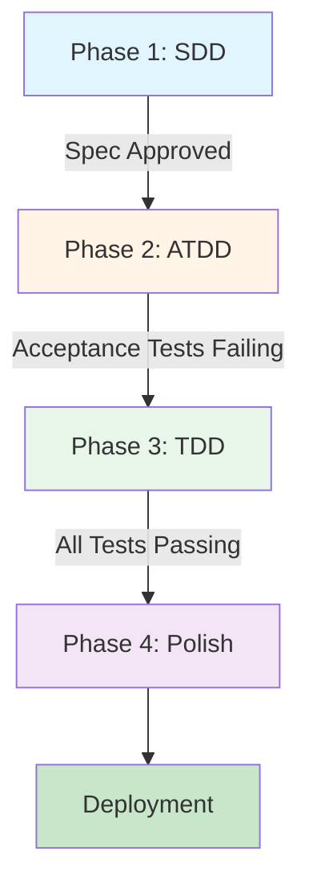

---

description: "Task list template for feature implementation"
---

# Tasks: [FEATURE NAME]

**Input**: Design documents from `/specs/[###-feature-name]/`
**Prerequisites**: plan.md (required), spec.md (required for user stories), research.md, data-model.md, contracts/

**Three-Phase Methodology**: CONSTITUTIONAL REQUIREMENT (Section VI) - ALL features MUST follow:
  1. **Phase 1: Spec-Driven Design (SDD)** - Define WHAT to build
  2. **Phase 2: Acceptance Test-Driven Design (ATDD)** - Define HOW to verify success
  3. **Phase 3: Test-Driven Design (TDD)** - Define HOW to build it correctly

**Coverage**: CONSTITUTIONAL REQUIREMENT (Section VII) - Minimum 80% coverage for logic, 100% for security-critical paths.

**Organization**: Tasks are organized by three-phase methodology, then by user story within each phase.

## Format: `[ID] [P?] [Story] Description`

- **[P]**: Can run in parallel (different files, no dependencies)
- **[Story]**: Which user story this task belongs to (e.g., US1, US2, US3)
- Include exact file paths in descriptions

## Path Conventions

**CONSTITUTIONAL REQUIREMENT (Section III)**: Organize by VERTICAL SLICES, not horizontal layers.

- **Hunt Board NPM Library**: `src/features/[feature-name]/components/`, `src/stories/`, `tests/`
  - Components in: `atoms/`, `organisms/`, `pages/` (NO Molecules per Section II)
  - Vertical slice contains: components, actions, validation, types
- **Single project**: `src/`, `tests/` at repository root
- **Web app**: `backend/src/features/`, `frontend/src/features/`
- **Mobile**: `api/src/features/`, `ios/src/` or `android/src/`
- Paths shown below assume Hunt Board structure - adjust based on plan.md structure

<!-- 
  ============================================================================
  IMPORTANT: The tasks below are SAMPLE TASKS for illustration purposes only.
  
  The /speckit.tasks command MUST replace these with actual tasks based on:
  - User stories from spec.md (with their priorities P1, P2, P3...)
  - Feature requirements from plan.md
  - Entities from data-model.md
  - Endpoints from contracts/
  
  Tasks MUST be organized by the three-phase methodology:
  - Phase 1: SDD (specification writing and approval)
  - Phase 2: ATDD (acceptance tests for each user story)
  - Phase 3: TDD (unit tests, implementation, refactoring)
  
  Each user story goes through all three phases before moving to next story.
  ============================================================================
-->

---

## Phase 1: Spec-Driven Design (SDD)

**Purpose**: Define WHAT to build and WHY before any code or tests.

**Entry Criteria**: Feature request approved, business value articulated

- [ ] T001 Write feature specification in `/specs/[###-feature-name]/spec.md`
  - [ ] Define user stories with priorities (P1, P2, P3...)
  - [ ] Write acceptance criteria in Given/When/Then format
  - [ ] Define functional requirements (FR-001, FR-002...)
  - [ ] Identify key entities and data models
  - [ ] Define component architecture (if UI: Atoms/Organisms/Pages)
  - [ ] Specify accessibility requirements (WCAG AA)
  - [ ] Define Storybook story requirements (if UI)
  - [ ] Document edge cases and error scenarios
- [ ] T002 Review specification with stakeholders
  - [ ] Business alignment validation
  - [ ] Technical feasibility review
  - [ ] Identify gaps and ambiguities
  - [ ] Revise until complete and unambiguous
- [ ] T003 Create implementation plan in `/specs/[###-feature-name]/plan.md`
  - [ ] Technical approach and architecture
  - [ ] Dependencies and integration points
  - [ ] Performance goals and constraints
  - [ ] Security considerations
  - [ ] Data model design
  - [ ] Component hierarchy (if UI)

**Exit Criteria (Gate to Phase 2)**:
- [ ] Specification approved by stakeholders
- [ ] All acceptance criteria are testable (Given/When/Then format)
- [ ] Technical design reviewed and approved
- [ ] No open questions or ambiguities remain
- [ ] Constitutional compliance verified (Section I checklist)

---

## Phase 2: Acceptance Test-Driven Design (ATDD)

**Purpose**: Define HOW to verify success by writing acceptance tests BEFORE implementation.

**Entry Criteria**: Phase 1 complete, acceptance criteria testable, test framework configured

**Test Data Standard (Section VII)**: Integration/E2E tests MUST use `@faker-js/faker` generated data and MUST include boundary/extreme scenarios.

### User Story 1 - [Title] (Priority: P1) 🎯

**Acceptance Criteria** (from spec.md):
1. GIVEN [state] WHEN [action] THEN [outcome]
2. GIVEN [state] WHEN [action] THEN [outcome]

**Acceptance Tests** (E2E/Integration - WRITE FIRST):

- [ ] T004 [P] [US1] Write E2E test for acceptance criterion #1 in `e2e/[feature].spec.ts`
  - Use Given/When/Then structure
  - Use Faker-generated test data (`@faker-js/faker`), not static-only fixtures
  - Test from user interface level (click, type, navigate)
  - Include console error detection
  - Verify data persistence (reload page test)
  - Include extreme case coverage (high volume cards/items, very long text, special characters)
  - Capture screenshots for evidence
  - **Run test → verify it FAILS (red phase)**
- [ ] T005 [P] [US1] Write E2E test for acceptance criterion #2 in `e2e/[feature].spec.ts`
  - **Run test → verify it FAILS (red phase)**
- [ ] T006 [P] [US1] Write integration test for [multi-component interaction] in `tests/integration/[feature].test.ts`
  - Test component interactions and data flow
  - Use Faker factories/builders and deterministic seeds for CI reproducibility
  - **Run test → verify it FAILS (red phase)**
- [ ] T007 [P] [US1] Write error scenario test for [edge case] in `e2e/[feature].spec.ts`
  - Test negative cases and error handling
  - Include stress and boundary data (oversized names/text, sparse optional fields)
  - **Run test → verify it FAILS (red phase)**

**Exit Criteria for User Story 1 ATDD**:
- [ ] Every acceptance criterion has corresponding test
- [ ] All acceptance tests run and FAIL (proves they can detect issues)
- [ ] Product Manager reviewed and approved tests
- [ ] Test evidence plan documented
- [ ] Faker-driven edge-case coverage documented

### User Story 2 - [Title] (Priority: P2)

**Acceptance Tests** (E2E/Integration - WRITE FIRST):

- [ ] T008 [P] [US2] Write E2E test for acceptance criterion #1
  - Use Faker-generated data with boundary/extreme profile
  - **Run test → verify it FAILS (red phase)**
- [ ] T009 [P] [US2] Write E2E test for acceptance criterion #2
  - Include excessive volume scenario (many cards/items)
  - **Run test → verify it FAILS (red phase)**

**Exit Criteria for User Story 2 ATDD**:
- [ ] Every acceptance criterion has corresponding test
- [ ] All acceptance tests FAILING (red phase)
- [ ] Faker-driven edge-case coverage documented

[Repeat for additional user stories...]

**Phase 2 Complete - Gate to Phase 3**:
- [ ] All acceptance tests written for ALL user stories
- [ ] All acceptance tests currently FAILING
- [ ] Tests are readable and maintainable
- [ ] Test framework configured (Playwright/Cypress)
- [ ] Faker-based data generation implemented for integration/E2E tests
- [ ] Extreme scenario matrix covered (high volume, long text, special chars, sparse fields)

---

## Phase 3: Test-Driven Design (TDD)

**Purpose**: Define HOW to build it correctly by writing unit tests BEFORE implementation.

**Entry Criteria**: Phase 2 complete (acceptance tests failing), Zod schemas defined

### Foundational Infrastructure (Zod Schemas, Data Layer)

- [ ] T010 [P] Create Zod schema for [Entity1] in `src/features/[feature]/validation/[entity1].schema.ts`
- [ ] T011 [P] Create Zod schema for [Entity2] in `src/features/[feature]/validation/[entity2].schema.ts`
- [ ] T012 [P] Generate types from schemas (Section IV: types from schemas, not hand-written)
- [ ] T013 [P] Create data access layer in `src/features/[feature]/data/` (if applicable)

### Foundational Tests (TDD - WRITE FIRST) ⚠️

> **CRITICAL**: Write tests FIRST, see them FAIL, then implement to make them PASS
> **RED-GREEN-REFACTOR**: Test (red) → Code (green) → Improve (refactor)

- [ ] T014 [P] **RED**: Write unit test for [Entity1] schema validation in `src/features/[feature]/validation/[entity1].schema.test.ts`
  - Test valid data passes validation
  - Test invalid data rejected with proper errors
  - Test helper functions (e.g., `createEntity1`) produce valid schema-compliant data
  - Test edge cases (empty strings, boundary values, special characters)
  - Test generated IDs match schema regex patterns
  - **Run test → verify it FAILS**
- [ ] T015 [P] **GREEN**: Implement [Entity1] schema to make tests pass
  - **Run test → verify it PASSES**
- [ ] T016 [P] **REFACTOR**: Improve [Entity1] schema implementation
  - **Run test → verify still PASSES**
- [ ] T017 [P] **RED**: Write unit test for [Entity2] schema validation
  - **Run test → verify it FAILS**
- [ ] T018 [P] **GREEN**: Implement [Entity2] schema to make tests pass
  - **Run test → verify it PASSES**

**Checkpoint**: ✅ Foundation AND foundational tests complete

**Gate Check**: 
- [ ] All Zod schemas have passing unit tests?
- [ ] All schema helper functions (e.g., createEntity) validated with tests?
- [ ] Test infrastructure (Vitest/Jest) configured and running?
- [ ] Test coverage reporting configured?
- [ ] All foundational tests PASSING (green phase)?

---

### User Story 1 - [Title] (Priority: P1) 🎯

**Goal**: [Brief description from spec.md]

**TDD Cycle**: Red (write test) → Green (minimal implementation) → Refactor (improve code)

#### Unit Tests (WRITE FIRST - TDD Red Phase) ⚠️

- [ ] T019 [P] [US1] **RED**: Write unit test for [business logic function] in `tests/unit/[feature]/[module].test.ts`
  - Test pure functions, calculations, transformations
  - Test edge cases and boundary values
  - **Run test → verify it FAILS**
- [ ] T020 [P] [US1] **RED**: Write unit test for [validation helper] in `tests/unit/[feature]/[validation].test.ts`
  - Test data validation logic
  - Test error message generation
  - **Run test → verify it FAILS**

#### Component Tests (WRITE FIRST - TDD Red Phase) ⚠️

- [ ] T021 [P] [US1] **RED**: Write component test for [Atom] in `tests/component/[Atom].test.tsx`
  - Test rendering with React Testing Library
  - Test user interactions (click, type, submit)
  - Test accessibility (ARIA labels, keyboard navigation)
  - **Run test → verify it FAILS**
- [ ] T022 [P] [US1] **RED**: Write component test for [Organism] in `tests/component/[Organism].test.tsx`
  - Test composition behavior
  - Test state management
  - **Run test → verify it FAILS**

#### Implementation (TDD Green Phase) ✅

- [ ] T023 [P] [US1] **GREEN**: Implement [business logic function]
  - Write minimal code to make test pass
  - **Run test → verify it PASSES**
- [ ] T024 [P] [US1] **GREEN**: Implement [validation helper]
  - **Run test → verify it PASSES**
- [ ] T025 [US1] **GREEN**: Implement [Atom] component in `src/features/[feature]/components/atoms/[Atom].tsx`
  - Material UI base component
  - Props interface
  - **Run test → verify it PASSES**
- [ ] T026 [US1] **GREEN**: Implement [Organism] component in `src/features/[feature]/components/organisms/[Organism].tsx`
  - Compose atoms and MUI components
  - State management hooks
  - **Run test → verify it PASSES**

#### Refactoring (TDD Refactor Phase) ♻️

- [ ] T027 [P] [US1] **REFACTOR**: Improve code quality in [module]
  - Extract duplicated code
  - Improve naming and readability
  - Optimize performance
  - **Run tests → verify still PASSING**

#### Verification

- [ ] T028 [US1] **VERIFY**: Run acceptance tests from Phase 2
  - Acceptance tests from Phase 2 should now PASS
  - If failing, implement missing functionality
  - **All acceptance tests for US1 must be PASSING**

#### Storybook Stories (UI Documentation) 📖

- [ ] T029 [P] [US1] Create [Atom].stories.tsx in `src/stories/atoms/`
  - Default, Empty, Disabled, Max Content states
  - Interactive controls for all props
  - @storybook/addon-a11y checks
- [ ] T030 [P] [US1] Create [Organism].stories.tsx in `src/stories/organisms/`
  - All required states and variations
  - Accessibility validation
  - Interaction tests (if applicable)

**Exit Criteria for User Story 1**:
- [ ] All unit tests PASSING  
- [ ] All component tests PASSING
- [ ] All acceptance tests from Phase 2 now PASSING
- [ ] Code coverage ≥ 80%
- [ ] Storybook stories complete
- [ ] User Story 1 independently functional

---

### User Story 2 - [Title] (Priority: P2)

**TDD Cycle**: Red → Green → Refactor

#### Unit & Component Tests (WRITE FIRST) ⚠️

- [ ] T031 [P] [US2] **RED**: Write unit test for [logic]
  - **Run test → verify it FAILS**
- [ ] T032 [P] [US2] **RED**: Write component test for [Component]
  - **Run test → verify it FAILS**

#### Implementation (GREEN) ✅

- [ ] T033 [P] [US2] **GREEN**: Implement [logic]
  - **Run test → verify it PASSES**
- [ ] T034 [US2] **GREEN**: Implement [Component]
  - **Run test → verify it PASSES**

#### Refactoring ♻️

- [ ] T035 [P] [US2] **REFACTOR**: Improve code quality
  - **Run tests → verify still PASSING**

#### Verification

- [ ] T036 [US2] **VERIFY**: Acceptance tests from Phase 2 now PASS

#### Storybook Stories 📖

- [ ] T037 [P] [US2] Create [Component].stories.tsx

**Exit Criteria for User Story 2**:
- [ ] All tests PASSING
- [ ] Acceptance tests from Phase 2 PASSING
- [ ] Coverage ≥ 80%

[Repeat for additional user stories...]

---

**Phase 3 Complete - Gate to Deployment**:
- [ ] All user stories have passing unit tests
- [ ] All user stories have passing component tests
- [ ] All acceptance tests from Phase 2 now PASSING
- [ ] Code coverage ≥ 80% (100% for security-critical)
- [ ] All Storybook stories complete
- [ ] No failing tests
- [ ] Code reviewed for quality

---

## Phase 4: Polish & Cross-Cutting Concerns

**Purpose**: Final integration, optimization, and quality enhancements

**Entry Criteria**: Phase 3 complete, all acceptance tests passing

### Performance Optimization

- [ ] T038 [P] Optimize [Component] with React.memo (custom comparison)
- [ ] T039 [P] Add useCallback to event handlers (prevent unnecessary re-renders)
- [ ] T040 [P] Add useMemo to expensive computations
- [ ] T041 Implement debounced operations (localStorage writes, search input)

### Accessibility Enhancements

- [ ] T042 [P] Add comprehensive ARIA labels to all interactive elements
- [ ] T043 [P] Implement keyboard navigation for complex interactions
- [ ] T044 [P] Add focus trap to modals
- [ ] T045 [P] Verify all text meets 4.5:1 contrast ratio (run axe-core tests)

### Documentation & Final Touches

- [ ] T046 Create README.md for feature in `src/features/[feature]/`
- [ ] T047 Update main README.md with feature usage examples
- [ ] T048 Generate API documentation (if applicable)

### Final Quality Gates

- [ ] All three phases complete (SDD → ATDD → TDD)
- [ ] All acceptance tests passing
- [ ] All unit/component tests passing
- [ ] Code coverage ≥ 80%
- [ ] All Storybook stories complete with a11y checks
- [ ] Performance goals met
- [ ] Accessibility validated (WCAG AA)
- [ ] Documentation complete

---

## Summary: Three-Phase Development Workflow



**Phase 1 (SDD)**: Write spec.md → Review → Approve  
**Phase 2 (ATDD)**: Write acceptance tests → All failing (red)  
**Phase 3 (TDD)**: Write unit tests → Implement → Refactor → All tests passing (green)  
**Phase 4 (Polish)**: Optimize → Accessibility → Documentation  

**Golden Rule**: Never skip a phase. Never reverse the order.

**Purpose**: Improvements that affect multiple user stories

- [ ] TXXX [P] Documentation updates in docs/
- [ ] TXXX Code cleanup and refactoring
- [ ] TXXX Performance optimization across all stories
- [ ] TXXX [P] Additional unit tests to reach 80% coverage (Section VII)
- [ ] TXXX Verify 100% coverage for security-critical paths (Section VII)
- [ ] TXXX Security hardening
- [ ] TXXX [P] Final a11y audit across all components (Section V)
- [ ] TXXX [P] Visual regression test baseline updates
- [ ] TXXX Verify tree-shakability (Section XI: NPM Library Requirements)
- [ ] TXXX Verify explicit exports, no defaults (Section XI)
- [ ] TXXX Run quickstart.md validation

---

## Dependencies & Execution Order

### Phase Dependencies

- **Setup (Phase 1)**: No dependencies - can start immediately
- **Foundational (Phase 2)**: Depends on Setup completion - BLOCKS all user stories
- **User Stories (Phase 3+)**: All depend on Foundational phase completion
  - User stories can then proceed in parallel (if staffed)
  - Or sequentially in priority order (P1 → P2 → P3)
- **Polish (Final Phase)**: Depends on all desired user stories being complete

### User Story Dependencies

- **User Story 1 (P1)**: Can start after Foundational (Phase 2) - No dependencies on other stories
- **User Story 2 (P2)**: Can start after Foundational (Phase 2) - May integrate with US1 but should be independently testable
- **User Story 3 (P3)**: Can start after Foundational (Phase 2) - May integrate with US1/US2 but should be independently testable

### Within Each User Story

- Tests (if included) MUST be written and FAIL before implementation
- Models before services
- Services before endpoints
- Core implementation before integration
- Story complete before moving to next priority

### Parallel Opportunities

- All Setup tasks marked [P] can run in parallel
- All Foundational tasks marked [P] can run in parallel (within Phase 2)
- Once Foundational phase completes, all user stories can start in parallel (if team capacity allows)
- All tests for a user story marked [P] can run in parallel
- Models within a story marked [P] can run in parallel
- Different user stories can be worked on in parallel by different team members

---

## Parallel Example: User Story 1

```bash
# Launch all tests for User Story 1 together (if tests requested):
Task: "Contract test for [endpoint] in tests/contract/test_[name].py"
Task: "Integration test for [user journey] in tests/integration/test_[name].py"

# Launch all models for User Story 1 together:
Task: "Create [Entity1] model in src/models/[entity1].py"
Task: "Create [Entity2] model in src/models/[entity2].py"
```

---

## Implementation Strategy

### MVP First (User Story 1 Only)

1. Complete Phase 1: Setup
2. Complete Phase 2: Foundational (CRITICAL - blocks all stories)
3. Complete Phase 3: User Story 1
4. **STOP and VALIDATE**: Test User Story 1 independently
5. Deploy/demo if ready

### Incremental Delivery

1. Complete Setup + Foundational → Foundation ready
2. Add User Story 1 → Test independently → Deploy/Demo (MVP!)
3. Add User Story 2 → Test independently → Deploy/Demo
4. Add User Story 3 → Test independently → Deploy/Demo
5. Each story adds value without breaking previous stories

### Parallel Team Strategy

With multiple developers:

1. Team completes Setup + Foundational together
2. Once Foundational is done:
   - Developer A: User Story 1
   - Developer B: User Story 2
   - Developer C: User Story 3
3. Stories complete and integrate independently

---

## Notes

- [P] tasks = different files, no dependencies
- [Story] label maps task to specific user story for traceability
- Each user story should be independently completable and testable
- Verify tests fail before implementing
- Commit after each task or logical group
- Stop at any checkpoint to validate story independently
- Avoid: vague tasks, same file conflicts, cross-story dependencies that break independence
