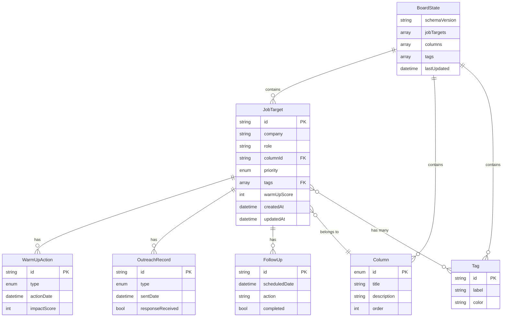

# Data Model & Validation Schemas

**Feature**: Kanban Board Interface  
**Branch**: `001-kanban-board`  
**Date**: 2026-02-18  
**Status**: Complete

This document defines all data entities using Zod schemas. TypeScript types are generated from these schemas (never hand-written, per Section IV of the constitution).

---

## Schema Version

```typescript
// src/features/kanban-board/validation/schemaVersion.ts
export const SCHEMA_VERSION = 'v1.0.0';
```

---

## 1. Enums & Constants

```typescript
// src/features/kanban-board/validation/enums.ts
import { z } from 'zod';

/**
 * Priority levels for job targets
 */
export const PrioritySchema = z.enum(['low', 'medium', 'high']);
export type Priority = z.infer<typeof PrioritySchema>;

/**
 * Predefined column IDs matching the 9 hunting-oriented columns
 */
export const ColumnIdSchema = z.enum([
  'targets-identified',
  'intel-gathering',
  'warm-up-phase',
  'outreach-initiated',
  'follow-up-required',
  'conversation-started',
  'interview-pipeline',
  'stalled-cold',
  'offer-success'
]);
export type ColumnId = z.infer<typeof ColumnIdSchema>;

/**
 * Outreach types for tracking contact methods
 */
export const OutreachTypeSchema = z.enum([
  'dm',
  'email',
  'referral-request',
  'recruiter-contact',
  'application-submitted',
  'cold-call',
  'networking-event'
]);
export type OutreachType = z.infer<typeof OutreachTypeSchema>;

/**
 * Warm-up action types for relationship building
 */
export const WarmUpActionTypeSchema = z.enum([
  'follow-linkedin',
  'engage-post',
  'comment',
  'join-community',
  'attend-event',
  'read-content',
  'share-content'
]);
export type WarmUpActionType = z.infer<typeof WarmUpActionTypeSchema>;

/**
 * State reason for closed/stalled targets
 */
export const StateReasonSchema = z.enum([
  'hired-elsewhere',
  'role-frozen',
  'no-response',
  'not-interested',
  'offer-accepted',
  'offer-declined',
  'company-not-fit',
  'timeline-mismatch'
]).optional();
export type StateReason = z.infer<typeof StateReasonSchema>;

/**
 * Interview pipeline stages
 */
export const InterviewStageSchema = z.enum([
  'screening',
  'technical',
  'team-interview',
  'hiring-manager',
  'final-round',
  'offer-pending'
]);
export type InterviewStage = z.infer<typeof InterviewStageSchema>;
```

---

## 2. Tag Entity

```typescript
// src/features/kanban-board/validation/tag.schema.ts
import { z } from 'zod';

/**
 * Tag for categorizing job targets
 * Examples: "high-priority", "referral-ready", "remote", "startup"
 */
export const TagSchema = z.object({
  /** Unique tag identifier (kebab-case) */
  id: z.string().regex(/^[a-z0-9-]+$/, 'Tag ID must be kebab-case'),
  
  /** Display label */
  label: z.string().min(1).max(30),
  
  /** Hex color code for chip background */
  color: z.string().regex(/^#[0-9A-Fa-f]{6}$/, 'Color must be hex format'),
  
  /** Creation timestamp */
  createdAt: z.string().datetime()
});

export type Tag = z.infer<typeof TagSchema>;

/**
 * Validation helper: Create new tag with defaults
 */
export const createTag = (label: string, color?: string): Tag => {
  const id = label.toLowerCase().replace(/\s+/g, '-').replace(/[^a-z0-9-]/g, '');
  return TagSchema.parse({
    id,
    label,
    color: color || '#757575', // default grey
    createdAt: new Date().toISOString()
  });
};
```

---

## 3. Follow-Up Entity

```typescript
// src/features/kanban-board/validation/followUp.schema.ts
import { z } from 'zod';

/**
 * Scheduled follow-up action for a job target
 */
export const FollowUpSchema = z.object({
  /** Follow-up unique ID (UUID) */
  id: z.string().uuid(),
  
  /** Scheduled follow-up date (ISO 8601) */
  scheduledDate: z.string().datetime(),
  
  /** Follow-up action description */
  action: z.string().min(1).max(500),
  
  /** Completion status */
  completed: z.boolean().default(false),
  
  /** Completion timestamp (if completed) */
  completedAt: z.string().datetime().optional(),
  
  /** Notes after completing follow-up */
  notes: z.string().max(1000).optional()
});

export type FollowUp = z.infer<typeof FollowUpSchema>;
```

---

## 4. Outreach Record Entity

```typescript
// src/features/kanban-board/validation/outreachRecord.schema.ts
import { z } from 'zod';
import { OutreachTypeSchema } from './enums';

/**
 * Record of outreach attempt to company/hiring manager
 */
export const OutreachRecordSchema = z.object({
  /** Outreach unique ID (UUID) */
  id: z.string().uuid(),
  
  /** Type of outreach */
  type: OutreachTypeSchema,
  
  /** Date outreach was sent */
  sentDate: z.string().datetime(),
  
  /** Person contacted (optional) */
  contactPerson: z.string().max(100).optional(),
  
  /** Message template used (optional) */
  messageTemplate: z.string().max(50).optional(),
  
  /** Whether a referral was involved */
  hasReferral: z.boolean().default(false),
  
  /** Referrer name (if hasReferral = true) */
  referrerName: z.string().max(100).optional(),
  
  /** Response received? */
  responseReceived: z.boolean().default(false),
  
  /** Response date (if responseReceived = true) */
  responseDate: z.string().datetime().optional(),
  
  /** Notes about outreach/response */
  notes: z.string().max(1000).optional()
});

export type OutreachRecord = z.infer<typeof OutreachRecordSchema>;
```

---

## 5. Warm-Up Action Entity

```typescript
// src/features/kanban-board/validation/warmUpAction.schema.ts
import { z } from 'zod';
import { WarmUpActionTypeSchema } from './enums';

/**
 * Warm-up action taken before outreach (relationship building)
 */
export const WarmUpActionSchema = z.object({
  /** Action unique ID (UUID) */
  id: z.string().uuid(),
  
  /** Type of warm-up action */
  type: WarmUpActionTypeSchema,
  
  /** Date action was taken */
  actionDate: z.string().datetime(),
  
  /** Person targeted by action (e.g., hiring manager) */
  targetPerson: z.string().max(100).optional(),
  
  /** Description of action taken */
  description: z.string().max(500),
  
  /** Impact score (0-100) for warm-up score calculation */
  impactScore: z.number().int().min(0).max(100).default(10)
});

export type WarmUpAction = z.infer<typeof WarmUpActionSchema>;
```

---

## 6. Column Entity

```typescript
// src/features/kanban-board/validation/column.schema.ts
import { z } from 'zod';
import { ColumnIdSchema } from './enums';

/**
 * Kanban column configuration
 * Defines the 9 hunting-oriented columns
 */
export const ColumnSchema = z.object({
  /** Column unique ID (from ColumnIdSchema enum) */
  id: ColumnIdSchema,
  
  /** Display title */
  title: z.string().min(1).max(50),
  
  /** Column description (help text) */
  description: z.string().max(200),
  
  /** Display order (0-8 for 9 columns) */
  order: z.number().int().min(0).max(8),
  
  /** Material UI icon name (optional) */
  iconName: z.string().optional(),
  
  /** Column color (for header accent) */
  color: z.string().regex(/^#[0-9A-Fa-f]{6}$/).optional()
});

export type Column = z.infer<typeof ColumnSchema>;

/**
 * Default column definitions (9 hunting-oriented columns)
 */
export const DEFAULT_COLUMNS: Column[] = [
  {
    id: 'targets-identified',
    title: 'Targets Identified',
    description: 'Jobs, companies, or teams that look interesting but need research',
    order: 0,
    color: '#9E9E9E'
  },
  {
    id: 'intel-gathering',
    title: 'Intel Gathering',
    description: 'Research phase before any outreach',
    order: 1,
    color: '#2196F3'
  },
  {
    id: 'warm-up-phase',
    title: 'Warm-Up Phase',
    description: 'Building relationships before outreach',
    order: 2,
    color: '#FF9800'
  },
  {
    id: 'outreach-initiated',
    title: 'Outreach Initiated',
    description: 'First contact made',
    order: 3,
    color: '#4CAF50'
  },
  {
    id: 'follow-up-required',
    title: 'Follow-Up Required',
    description: 'Cards needing follow-up action',
    order: 4,
    color: '#F44336'
  },
  {
    id: 'conversation-started',
    title: 'Conversation Started',
    description: 'Active engagement with company',
    order: 5,
    color: '#9C27B0'
  },
  {
    id: 'interview-pipeline',
    title: 'Interview Pipeline',
    description: 'Formal interview process',
    order: 6,
    color: '#3F51B5'
  },
  {
    id: 'stalled-cold',
    title: 'Stalled / Cold',
    description: 'Trail went cold',
    order: 7,
    color: '#607D8B'
  },
  {
    id: 'offer-success',
    title: 'Offer / Success',
    description: 'Offers received or strong leads',
    order: 8,
    color: '#4CAF50'
  }
];
```

---

## 7. Job Target Entity (Main)

```typescript
// src/features/kanban-board/validation/jobTarget.schema.ts
import { z } from 'zod';
import { PrioritySchema, ColumnIdSchema, StateReasonSchema, InterviewStageSchema } from './enums';
import { TagSchema } from './tag.schema';
import { FollowUpSchema } from './followUp.schema';
import { OutreachRecordSchema } from './outreachRecord.schema';
import { WarmUpActionSchema } from './warmUpAction.schema';

/**
 * Core job target entity (Kanban card)
 */
export const JobTargetSchema = z.object({
  /** Unique job target ID (prefixed: jt_) */
  id: z.string().regex(/^jt_[a-zA-Z0-9]+$/, 'ID must start with jt_'),
  
  /** Company name (required) */
  company: z.string().min(1).max(100),
  
  /** Role title (optional for early-stage targets) */
  role: z.string().max(100).optional(),
  
  /** Why this is a target */
  targetReason: z.string().max(500).optional(),
  
  /** Source of the lead (e.g., "LinkedIn post", "Referral from Jane") */
  source: z.string().max(200).optional(),
  
  /** Current column ID */
  columnId: ColumnIdSchema,
  
  /** Priority level */
  priority: PrioritySchema.default('medium'),
  
  /** Tags (array of tag IDs) */
  tags: z.array(z.string()).default([]),
  
  /** Warm-up score (0-100) */
  warmUpScore: z.number().int().min(0).max(100).default(0),
  
  /** Warm-up actions taken */
  warmUpActions: z.array(WarmUpActionSchema).default([]),
  
  /** Outreach attempts */
  outreachRecords: z.array(OutreachRecordSchema).default([]),
  
  /** Scheduled follow-ups */
  followUps: z.array(FollowUpSchema).default([]),
  
  /** Next follow-up date (denormalized for quick access) */
  nextFollowUpDate: z.string().datetime().optional(),
  
  /** Interview stage (if in interview pipeline) */
  interviewStage: InterviewStageSchema.optional(),
  
  /** Interview dates and feedback */
  interviewNotes: z.string().max(2000).optional(),
  
  /** Key people identified (hiring manager, team members) */
  keyPeople: z.array(z.object({
    name: z.string().max(100),
    role: z.string().max(100).optional(),
    linkedInUrl: z.string().url().optional(),
    notes: z.string().max(500).optional()
  })).default([]),
  
  /** General notes */
  notes: z.string().max(5000).optional(),
  
  /** Signals (profile views, post likes, etc.) */
  signals: z.array(z.object({
    type: z.enum(['profile-view', 'post-like', 'connection-accept', 'message', 'other']),
    date: z.string().datetime(),
    description: z.string().max(200).optional()
  })).default([]),
  
  /** State reason (for stalled/closed targets) */
  stateReason: StateReasonSchema,
  
  /** Attachments (file URLs or base64) */
  attachments: z.array(z.object({
    id: z.string().uuid(),
    name: z.string().max(100),
    type: z.enum(['image', 'pdf', 'url']),
    url: z.string().max(500),
    uploadedAt: z.string().datetime()
  })).default([]),
  
  /** Creation timestamp */
  createdAt: z.string().datetime(),
  
  /** Last update timestamp */
  updatedAt: z.string().datetime(),
  
  /** Archived status */
  archived: z.boolean().default(false)
});

export type JobTarget = z.infer<typeof JobTargetSchema>;

/**
 * Validation helper: Create new job target with defaults
 */
export const createJobTarget = (company: string, columnId: ColumnId = 'targets-identified'): JobTarget => {
  const now = new Date().toISOString();
  const id = `jt_${Date.now()}_${Math.random().toString(36).substring(2, 9)}`;
  
  return JobTargetSchema.parse({
    id,
    company,
    columnId,
    priority: 'medium',
    tags: [],
    warmUpScore: 0,
    warmUpActions: [],
    outreachRecords: [],
    followUps: [],
    keyPeople: [],
    signals: [],
    attachments: [],
    createdAt: now,
    updatedAt: now,
    archived: false
  });
};
```

---

## 8. Board State Entity

```typescript
// src/features/kanban-board/validation/boardState.schema.ts
import { z } from 'zod';
import { JobTargetSchema } from './jobTarget.schema';
import { ColumnSchema } from './column.schema';
import { TagSchema } from './tag.schema';

/**
 * Complete board state (for localStorage persistence)
 */
export const BoardStateSchema = z.object({
  /** Schema version for future migrations */
  schemaVersion: z.string().default('v1.0.0'),
  
  /** All job targets */
  jobTargets: z.array(JobTargetSchema).default([]),
  
  /** Column configurations (defaults to 9 hunting columns) */
  columns: z.array(ColumnSchema),
  
  /** Available tags */
  tags: z.array(TagSchema).default([]),
  
  /** Last updated timestamp */
  lastUpdated: z.string().datetime()
});

export type BoardState = z.infer<typeof BoardStateSchema>;
```

---

## 9. User Preferences Entity

```typescript
// src/features/kanban-board/validation/userPreferences.schema.ts
import { z } from 'zod';

/**
 * User preferences for board UI state
 */
export const UserPreferencesSchema = z.object({
  /** Active search query */
  searchQuery: z.string().max(200).default(''),
  
  /** Active filters */
  filters: z.object({
    priorities: z.array(z.enum(['low', 'medium', 'high'])).default([]),
    tags: z.array(z.string()).default([]),
    columns: z.array(z.string()).default([]), // Empty = all columns
    hasFollowUp: z.boolean().optional()
  }).default({}),
  
  /** Sort order */
  sortBy: z.enum(['created', 'updated', 'priority', 'company']).default('updated'),
  
  /** Sort direction */
  sortDirection: z.enum(['asc', 'desc']).default('desc'),
  
  /** Collapsed columns (array of column IDs) */
  collapsedColumns: z.array(z.string()).default([])
});

export type UserPreferences = z.infer<typeof UserPreferencesSchema>;
```

---

## 10. Validation Utilities

```typescript
// src/features/kanban-board/validation/utils.ts
import { z } from 'zod';

/**
 * Validate and parse data with Zod schema
 * Throws ZodError if validation fails
 */
export function validateData<T>(schema: z.ZodSchema<T>, data: unknown): T {
  return schema.parse(data);
}

/**
 * Safe validation (returns result object)
 */
export function safeValidateData<T>(
  schema: z.ZodSchema<T>,
  data: unknown
): { success: true; data: T } | { success: false; error: z.ZodError } {
  const result = schema.safeParse(data);
  if (result.success) {
    return { success: true, data: result.data };
  }
  return { success: false, error: result.error };
}

/**
 * Extract error messages from ZodError
 */
export function extractZodErrors(error: z.ZodError): string[] {
  return error.errors.map(err => `${err.path.join('.')}: ${err.message}`);
}
```

---

## 11. Type Inference (Generated Types)

```typescript
// src/features/kanban-board/types/index.ts

/**
 * All TypeScript types are inferred from Zod schemas.
 * NEVER hand-write types (constitutional requirement: Section IV).
 * 
 * This file re-exports all inferred types for convenience.
 */

export type {
  Priority,
  ColumnId,
  OutreachType,
  WarmUpActionType,
  StateReason,
  InterviewStage
} from '../validation/enums';

export type { Tag } from '../validation/tag.schema';
export type { FollowUp } from '../validation/followUp.schema';
export type { OutreachRecord } from '../validation/outreachRecord.schema';
export type { WarmUpAction } from '../validation/warmUpAction.schema';
export type { Column } from '../validation/column.schema';
export type { JobTarget } from '../validation/jobTarget.schema';
export type { BoardState } from '../validation/boardState.schema';
export type { UserPreferences } from '../validation/userPreferences.schema';
```

---

## 12. LocalStorage Integration

```typescript
// src/features/kanban-board/utils/storage.ts
import { BoardStateSchema, BoardState } from '../validation/boardState.schema';
import { UserPreferencesSchema, UserPreferences } from '../validation/userPreferences.schema';
import { DEFAULT_COLUMNS } from '../validation/column.schema';

const STORAGE_KEYS = {
  BOARD_STATE: 'hunt-board:board-state',
  USER_PREFS: 'hunt-board:user-prefs'
} as const;

/**
 * Load board state from localStorage with Zod validation
 */
export function loadBoardState(): BoardState {
  try {
    const stored = localStorage.getItem(STORAGE_KEYS.BOARD_STATE);
    if (!stored) {
      // Return default state
      return BoardStateSchema.parse({
        schemaVersion: 'v1.0.0',
        jobTargets: [],
        columns: DEFAULT_COLUMNS,
        tags: [],
        lastUpdated: new Date().toISOString()
      });
    }
    
    const parsed = JSON.parse(stored);
    return BoardStateSchema.parse(parsed); // Zod validation
  } catch (error) {
    console.error('[Storage] Failed to load board state:', error);
    // Fallback to empty state
    return BoardStateSchema.parse({
      schemaVersion: 'v1.0.0',
      jobTargets: [],
      columns: DEFAULT_COLUMNS,
      tags: [],
      lastUpdated: new Date().toISOString()
    });
  }
}

/**
 * Save board state to localStorage with Zod validation
 */
export function saveBoardState(state: BoardState): void {
  try {
    const validated = BoardStateSchema.parse(state); // Validate before saving
    const serialized = JSON.stringify(validated);
    localStorage.setItem(STORAGE_KEYS.BOARD_STATE, serialized);
  } catch (error) {
    console.error('[Storage] Failed to save board state:', error);
    throw new Error('Failed to save board state');
  }
}

/**
 * Load user preferences from localStorage
 */
export function loadUserPreferences(): UserPreferences {
  try {
    const stored = localStorage.getItem(STORAGE_KEYS.USER_PREFS);
    if (!stored) {
      return UserPreferencesSchema.parse({});
    }
    
    const parsed = JSON.parse(stored);
    return UserPreferencesSchema.parse(parsed);
  } catch (error) {
    console.error('[Storage] Failed to load user preferences:', error);
    return UserPreferencesSchema.parse({});
  }
}

/**
 * Save user preferences to localStorage
 */
export function saveUserPreferences(prefs: UserPreferences): void {
  try {
    const validated = UserPreferencesSchema.parse(prefs);
    const serialized = JSON.stringify(validated);
    localStorage.setItem(STORAGE_KEYS.USER_PREFS, serialized);
  } catch (error) {
    console.error('[Storage] Failed to save user preferences:', error);
  }
}
```

---

## 13. Data Relationships



---

## Summary

- **6 core entities**: JobTarget, Column, Tag, WarmUpAction, OutreachRecord, FollowUp
- **2 aggregate entities**: BoardState, UserPreferences
- **All types generated from Zod schemas** (constitutional requirement)
- **Validation at read/write boundaries** (localStorage integration)
- **No hand-written TypeScript interfaces** (single source of truth)
- **Schema versioning enabled** (future migration support)

**Next Phase**: Quickstart and implementation planning

