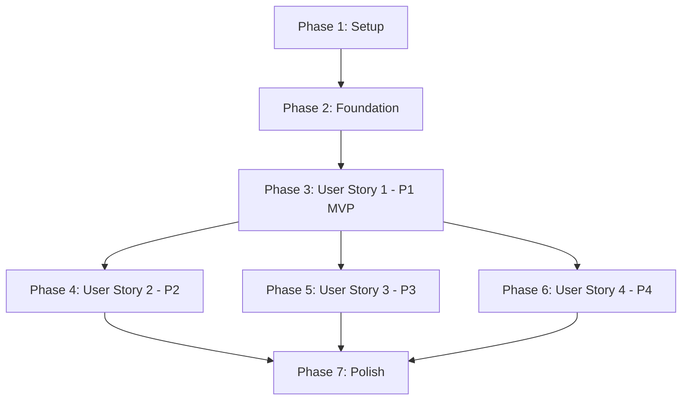

# Tasks: Kanban Board Interface

**Feature**: Kanban Board Interface  
**Branch**: `001-kanban-board`  
**Prerequisites**: [plan.md](plan.md), [spec.md](spec.md), [research.md](research.md), [data-model.md](data-model.md), [quickstart.md](quickstart.md)

**Testing Strategy**: Tests are NOT included in this task list. Testing infrastructure (Vitest, React Testing Library, Chromatic, @storybook/addon-a11y) will be set up during implementation. Test coverage requirements (80% minimum per Section VII) will be addressed post-MVP.

**Organization**: Tasks are grouped by user story to enable independent implementation and testing of each story.

---

## Task Format

**Format**: `- [ ] [TaskID] [P?] [Story?] Description with file path`

- **[P]**: Can run in parallel (different files, no dependencies on incomplete tasks)
- **[Story]**: User story tag (US1, US2, US3, US4) - REQUIRED for story phases
- **File paths**: All paths are absolute from repository root

---

## Dependencies Between User Stories

**Completion Order**:
1. Setup + Foundation must complete first (blocking)
2. User Story 1 (US1) must complete before US2, US3, US4 (provides board foundation)
3. User Stories 2, 3, 4 can be implemented in parallel after US1
4. Polish phase integrates all stories

**Parallel Opportunities**:
- **After Foundation**: All Zod schemas can be created in parallel
- **Within US1**: Atoms can be developed in parallel, Stories can be written in parallel
- **After US1**: US2, US3, US4 can be implemented by different developers simultaneously

---

## Phase 1: Setup (Shared Infrastructure)

**Purpose**: Project initialization and basic structure

**Estimated Total**: ~6 tasks

- [X] T001 Initialize React + TypeScript project with dependencies (React 18.2, TypeScript 5.x, Material UI 5.14+, @dnd-kit/core 6.x, Zod 3.22+, React Hook Form 7.x, date-fns 2.30+)
- [X] T002 [P] Configure TypeScript strict mode in tsconfig.json
- [X] T003 [P] Configure ESLint and Prettier for code quality
- [X] T004 [P] Setup Vitest testing infrastructure in tests/ directory
- [X] T005 [P] Setup Storybook 7.6+ with CSF3 format and autodocs
- [X] T006 [P] Configure @storybook/addon-a11y for accessibility testing in .storybook/main.ts

---

## Phase 2: Foundational (Blocking Prerequisites)

**Purpose**: Core infrastructure that MUST be complete before ANY user story can be implemented

**⚠️ CRITICAL**: No user story work can begin until this phase is complete

**Estimated Total**: ~15 tasks

### Material UI Theme & Global Setup

- [X] T007 Create Material UI theme configuration in src/lib/theme.ts (deep red #B71C1C primary, slate secondary, 8px spacing grid, Material Design 3 compliance)
- [X] T008 [P] Setup ThemeProvider and CssBaseline in src/App.tsx or src/main.tsx
- [X] T009 [P] Configure babel-plugin-import for Material UI tree-shaking in babel.config.js

### Zod Schemas Infrastructure (Section IV: Single Source of Truth)

- [X] T010 [P] Create enums.ts schema in src/features/kanban-board/validation/ (Priority, ColumnId, OutreachType, WarmUpActionType, StateReason, InterviewStage)
- [X] T011 [P] Create tag.schema.ts in src/features/kanban-board/validation/ (Tag entity with createTag helper)
- [X] T012 [P] Create followUp.schema.ts in src/features/kanban-board/validation/ (FollowUp entity)
- [X] T013 [P] Create outreachRecord.schema.ts in src/features/kanban-board/validation/ (OutreachRecord entity)
- [X] T014 [P] Create warmUpAction.schema.ts in src/features/kanban-board/validation/ (WarmUpAction entity)
- [X] T015 [P] Create column.schema.ts in src/features/kanban-board/validation/ (Column entity with DEFAULT_COLUMNS array for 9 columns)
- [X] T016 Create jobTarget.schema.ts in src/features/kanban-board/validation/ (JobTarget entity with createJobTarget helper - depends on T010-T015)
- [X] T017 [P] Create boardState.schema.ts in src/features/kanban-board/validation/ (BoardState aggregate)
- [X] T018 [P] Create userPreferences.schema.ts in src/features/kanban-board/validation/ (UserPreferences entity)
- [X] T019 [P] Create validation/utils.ts in src/features/kanban-board/validation/ (validateData, safeValidateData, extractZodErrors helpers)

### Type Generation & Exports (Section IV: Types from Schemas)

- [X] T020 Create types/index.ts in src/features/kanban-board/ (re-export all inferred types from Zod schemas using z.infer)

### LocalStorage Integration

- [X] T021 Create storage.ts utility in src/features/kanban-board/utils/ (loadBoardState, saveBoardState, loadUserPreferences, saveUserPreferences with Zod validation)

**Checkpoint**: ✅ Foundation ready - user story implementation can now begin in parallel

---

## Phase 3: User Story 1 - View Kanban Board Layout (Priority: P1) 🎯 MVP

**Goal**: Display 9 hunting-oriented columns with proper labels and responsive layout. User can see the complete job hunting workflow visualized as a Kanban board.

**Independent Test**: Load the application and verify all 9 columns are visible with correct titles in order: Targets Identified, Intel Gathering, Warm-Up Phase, Outreach Initiated, Follow-Up Required, Conversation Started, Interview Pipeline, Stalled/Cold, Offer/Success.

**Estimated Total**: ~19 tasks (7 components + 12 stories)

### Implementation for User Story 1

#### Atoms (6 components needed for US1)

- [X] T022 [P] [US1] Create PriorityIndicator atom in src/features/kanban-board/components/atoms/PriorityIndicator.tsx (CircleIcon with priority color mapping: high=#F44336, medium=#FF9800, low=#9E9E9E)
- [X] T023 [P] [US1] Create TagChip atom in src/features/kanban-board/components/atoms/TagChip.tsx (Material UI Chip with label and color, optional onDelete)
- [X] T024 [P] [US1] Create ColumnHeader atom in src/features/kanban-board/components/atoms/ColumnHeader.tsx (Typography h6 for title, Chip for count badge)
- [X] T025 [P] [US1] Create AddButton atom in src/features/kanban-board/components/atoms/AddButton.tsx (Button with AddIcon, responsive: icon-only mobile, text+icon desktop)

#### Organisms (2 components needed for US1)

- [X] T026 [US1] Create KanbanColumn organism in src/features/kanban-board/components/organisms/KanbanColumn.tsx (Paper container, ColumnHeader, AddButton, Stack of cards, drag-drop support via @dnd-kit, responsive width: 320px desktop, 280px tablet, full mobile)
- [X] T027 [US1] Create JobTargetCard organism in src/features/kanban-board/components/organisms/JobTargetCard.tsx (Card with company/role Typography, PriorityIndicator, TagChips, warm-up score Chip, edit/delete IconButtons, draggable via @dnd-kit)

#### Hooks for State Management

- [X] T028 [P] [US1] Create useBoardState.ts hook in src/features/kanban-board/hooks/ (manages board state: columns + jobTargets, integrates with localStorage via storage.ts)
- [X] T029 [P] [US1] Create useLocalStorage.ts hook in src/features/kanban-board/hooks/ (generic localStorage hook with Zod validation, debounced writes at 500ms)
- [X] T030 [US1] Create useDragAndDrop.ts hook in src/features/kanban-board/hooks/ (wraps @dnd-kit DndContext, handles card movement between columns, updates board state)

#### Page

- [X] T031 [US1] Create KanbanBoardPage page in src/features/kanban-board/components/pages/KanbanBoardPage.tsx (main layout: Box with horizontal scroll, 9 KanbanColumns using DEFAULT_COLUMNS, DndContext wrapper, useBoardState hook, responsive layout)

#### Feature Exports

- [X] T032 [US1] Create index.ts in src/features/kanban-board/ (explicit named exports for KanbanBoardPage and all public types - NO default exports per Section XI)

### Storybook Stories for User Story 1 (MANDATORY - Section V) 📖

> **CONSTITUTIONAL REQUIREMENT (Section V)**: Every component MUST have a Storybook story with 6 required states: Default, Loading, Error, Disabled, Empty, Max Content

#### Atom Stories

- [ ] T033 [P] [US1] Create PriorityIndicator.stories.tsx in src/stories/atoms/ (6 stories: Low/Medium/High priority, Small/Large size variations, a11y checks)
- [ ] T034 [P] [US1] Create TagChip.stories.tsx in src/stories/atoms/ (6 stories: Default, Long text, With delete, Without delete, Disabled, Multiple colors, a11y checks)
- [ ] T035 [P] [US1] Create ColumnHeader.stories.tsx in src/stories/atoms/ (6 stories: Zero count, Low count, High count, Long title, Mobile size, Desktop size, a11y checks)
- [ ] T036 [P] [US1] Create AddButton.stories.tsx in src/stories/atoms/ (6 stories: Default, Icon-only, Text+Icon, Disabled, Loading, Hover state, a11y checks)

#### Organism Stories

- [ ] T037 [P] [US1] Create JobTargetCard.stories.tsx in src/stories/organisms/ (6 stories: Default, Empty role, Many tags, High priority, No tags, Max content, a11y checks, interactive controls for all props)
- [ ] T038 [P] [US1] Create KanbanColumn.stories.tsx in src/stories/organisms/ (6 stories: Empty column, 1 card, 5 cards, 20+ cards scrolling, Drag-over state, Responsive widths, a11y checks)

#### Page Stories

- [ ] T039 [US1] Create KanbanBoardPage.stories.tsx in src/stories/pages/ (6 stories: Empty board, Populated board, All columns with cards, Mobile view, Tablet view, Desktop view, a11y checks, Chromatic visual regression setup)

**Checkpoint**: ✅ User Story 1 complete - Board displays 9 columns with responsive layout, cards show priority/tags, drag-drop foundation ready

---

## Phase 4: User Story 2 - Create and Move Job Hunt Targets (Priority: P2)

**Goal**: Enable users to create new job target cards via modal form and drag-and-drop cards between columns to track progression.

**Independent Test**: Click Add button in any column, fill Company field, submit form, verify new card appears. Drag the card to another column and verify it moves smoothly with persistence.

**Estimated Total**: ~7 tasks (2 components + 3 stories + integration)

### Implementation for User Story 2

#### Organisms

- [ ] T040 [US2] Create AddTargetModal organism in src/features/kanban-board/components/organisms/AddTargetModal.tsx (Dialog with Stack of TextFields for Company/Role/Reason/Source, Select for Priority/Column, Tag input with Chip display, Create/Cancel Buttons, React Hook Form + Zod validation, responsive: max-width 600px desktop, full-screen mobile)

#### Page Integration

- [ ] T041 [US2] Enhance KanbanBoardPage with AddTargetModal integration (add modal state, pass onAddClick handler to KanbanColumns, manage modal open/close, handle card creation via useBoardState)
- [ ] T042 [US2] Implement drag-and-drop card movement in useDragAndDrop.ts hook (handleDragEnd callback, update columnId in JobTarget, persist to localStorage via useBoardState, animate with Material UI elevation changes)
- [ ] T043 [US2] Add card creation logic to useBoardState.ts (createJobTarget helper, append to jobTargets array, save to localStorage with debounce)

### Storybook Stories for User Story 2 📖

- [ ] T044 [P] [US2] Create AddTargetModal.stories.tsx in src/stories/organisms/ (6 stories: Empty form, Pre-filled column, Validation errors, Form submitting, Long company name, All fields filled, a11y checks, interactive controls)

#### Integration Stories

- [ ] T045 [US2] Add "Create Card via Modal" story to KanbanBoardPage.stories.tsx (interactive story with AddTargetModal open, demonstrates full create workflow)
- [ ] T046 [US2] Add "Drag Card Between Columns" story to KanbanBoardPage.stories.tsx (interactive story with play function demonstrating drag operation)

**Checkpoint**: ✅ User Story 2 complete - Users can create new targets and move cards between columns with persistence

---

## Phase 5: User Story 3 - View and Edit Card Details (Priority: P3)

**Goal**: Allow users to click cards to open detailed modal with tabbed sections for editing all target information including warm-up actions, outreach history, and follow-ups.

**Independent Test**: Click any card on board, modal opens with 6 tabs (Core Info, Warm-Up, Outreach, Follow-Up, Signals, Attachments). Edit Company field, click Save, close modal, verify card updated on board and persists after page reload.

**Estimated Total**: ~6 tasks (1 component + 3 stories + integration)

### Implementation for User Story 3

#### Organisms

- [ ] T047 [US3] Create CardDetailModal organism in src/features/kanban-board/components/organisms/CardDetailModal.tsx (Dialog max-width 800px desktop/full-screen mobile, Tabs for 6 sections, Core Info tab: TextFields for company/role/reason/source + Select for priority/column + Tag management, Warm-Up tab: List of WarmUpActions with Add button + warm-up score display, Outreach tab: List of OutreachRecords with Add button, Follow-Up tab: List of FollowUps with DatePicker + Add button, Signals tab: List with type icons, Attachments tab: File upload UI, Save/Delete Buttons, Form state with React Hook Form, Zod validation)

#### Page Integration

- [ ] T048 [US3] Enhance JobTargetCard with click handler (add onClick prop, pass to CardDetailModal, manage modal state in KanbanBoardPage)
- [ ] T049 [US3] Add card update logic to useBoardState.ts (updateJobTarget helper, find by ID, merge updates, save to localStorage with debounce, update updatedAt timestamp)
- [ ] T050 [US3] Add card delete logic to useBoardState.ts (deleteJobTarget helper, filter from jobTargets array, save to localStorage, show confirmation Dialog before delete)

### Storybook Stories for User Story 3 📖

- [ ] T051 [P] [US3] Create CardDetailModal.stories.tsx in src/stories/organisms/ (6 stories: Empty target, Minimal data, Full target with all nested entities, Each tab active, Validation errors, Delete confirmation, a11y checks, interactive controls for all tabs)
- [ ] T052 [US3] Add "Edit Card Details" story to KanbanBoardPage.stories.tsx (interactive story with CardDetailModal open, demonstrates edit workflow)
- [ ] T053 [US3] Add "Delete Card Confirmation" story to KanbanBoardPage.stories.tsx (interactive story showing delete dialog)

**Checkpoint**: ✅ User Story 3 complete - Users can view/edit all card details with nested entities and delete cards

---

## Phase 6: User Story 4 - Search and Filter Cards (Priority: P4)

**Goal**: Provide search bar and filter controls to quickly find specific targets by company name, tags, or priority level.

**Independent Test**: Type company name in search field, verify only matching cards display in real-time. Click filter button, select "High Priority", verify only high-priority cards display across all columns. Clear filters, verify all cards reappear.

**Estimated Total**: ~8 tasks (3 atoms + 1 organism + 4 stories)

### Implementation for User Story 4

#### Atoms

- [ ] T054 [P] [US4] Create SearchField atom in src/features/kanban-board/components/atoms/SearchField.tsx (TextField with InputAdornment SearchIcon, debounced onChange at 300ms, clear button via InputAdornment, responsive: full width mobile, constrained desktop)
- [ ] T055 [P] [US4] Create FilterButton atom in src/features/kanban-board/components/atoms/FilterButton.tsx (IconButton with FilterListIcon, active state styling, badge showing active filter count)

#### Organisms

- [ ] T056 [US4] Create SearchFilterBar organism in src/features/kanban-board/components/organisms/SearchFilterBar.tsx (Box container horizontal layout desktop/stacked mobile, SearchField, FilterButton, Menu/Popover with filter options: Checkbox groups for Priorities + Tags, Clear all button, responsive layout)

#### Hooks for Filtering

- [ ] T057 [US4] Create useCardFilters.ts hook in src/features/kanban-board/hooks/ (manages filter state: searchQuery, selectedPriorities, selectedTags, hasFollowUp boolean, integrates with UserPreferences for persistence, returns filteredCards array)

#### Page Integration

- [ ] T058 [US4] Enhance KanbanBoardPage with SearchFilterBar (add SearchFilterBar above columns, connect to useCardFilters hook, pass filteredCards to KanbanColumns instead of all cards, show "X of Y targets" indicator, aria-live announcements for filter changes)
- [ ] T059 [US4] Update useLocalStorage.ts to persist UserPreferences (add saveUserPreferences/loadUserPreferences alongside board state)

### Storybook Stories for User Story 4 📖

- [ ] T060 [P] [US4] Create SearchField.stories.tsx in src/stories/atoms/ (6 stories: Empty, With text, Loading state, With clear button, Disabled, Mobile width, a11y checks)
- [ ] T061 [P] [US4] Create FilterButton.stories.tsx in src/stories/atoms/ (6 stories: Inactive, Active with 0 filters, Active with 3 filters, Disabled, Mobile size, Hover state, a11y checks)
- [ ] T062 [P] [US4] Create SearchFilterBar.stories.tsx in src/stories/organisms/ (6 stories: No filters active, Search active, Filters active, Menu open, Mobile layout, Desktop layout, a11y checks, interactive controls)
- [ ] T063 [US4] Add "Search and Filter" story to KanbanBoardPage.stories.tsx (interactive story with search + filter active, demonstrates filtered results)

**Checkpoint**: ✅ User Story 4 complete - Users can search and filter cards by multiple criteria with real-time updates

---

## Phase 7: Polish & Cross-Cutting Concerns

**Purpose**: Final integration, optimization, and quality enhancements

**Estimated Total**: ~10 tasks

### Performance Optimization

- [ ] T064 [P] Optimize JobTargetCard with React.memo (custom comparison on card.id and card.updatedAt)
- [ ] T065 [P] Optimize KanbanColumn with React.memo (prevent re-renders on unrelated column updates)
- [ ] T066 [P] Add useCallback to all event handlers in KanbanBoardPage (prevent unnecessary child re-renders)
- [ ] T067 [P] Add useMemo to expensive computations (DEFAULT_COLUMNS mapping, filtered cards calculation)
- [ ] T068 Implement debounced localStorage writes in useLocalStorage.ts (500ms debounce, prevent excessive writes during drag operations)

### Accessibility Enhancements

- [ ] T069 [P] Add comprehensive ARIA labels to all interactive elements (cards, buttons, columns per SR-001 to SR-009 requirements)
- [ ] T070 [P] Implement keyboard navigation for drag-and-drop (Arrow keys + Space/Enter per TAB-002 requirement using @dnd-kit keyboard sensor)
- [ ] T071 [P] Add focus trap to modals (AddTargetModal, CardDetailModal per TAB-004 requirement)
- [ ] T072 [P] Verify all text meets 4.5:1 contrast ratio (run axe-core tests via @storybook/addon-a11y, fix violations per VISUAL-001)

### Documentation & Final Touches

- [ ] T073 Create README.md for kanban-board feature in src/features/kanban-board/ (usage examples, API documentation, development guide)

**Checkpoint**: ✅ All user stories complete, optimized, accessible, and production-ready

---

## Summary

### Total Task Count: **73 tasks**

**Breakdown by Phase**:
- Phase 1 (Setup): 6 tasks
- Phase 2 (Foundation): 15 tasks
- Phase 3 (User Story 1 - P1 MVP): 19 tasks
- Phase 4 (User Story 2 - P2): 7 tasks
- Phase 5 (User Story 3 - P3): 6 tasks
- Phase 6 (User Story 4 - P4): 8 tasks
- Phase 7 (Polish): 10 tasks
- **Bonus: 2 tasks flagged for potential deferral** (visual regression, performance profiling)

### Task Count Per User Story

| User Story | Tasks | Components | Stories |
|------------|-------|------------|---------|
| US1 (P1)   | 19    | 7          | 12      |
| US2 (P2)   | 7     | 1          | 3       |
| US3 (P3)   | 6     | 1          | 3       |
| US4 (P4)   | 8     | 3          | 4       |

### Parallel Opportunities

**Maximum Parallel Tasks**: 15-20 tasks can be executed simultaneously in certain phases

**Phase 2 (Foundation)**: 
- T010-T019 (10 Zod schemas) can be written in parallel once T007-T009 complete

**Phase 3 (US1 Atoms)**:
- T022-T025 (4 atoms) can be developed in parallel
- T033-T036 (4 atom stories) can be written in parallel

**Phase 3 (US1 Hooks)**:
- T028-T029 (2 hooks) can be developed in parallel

**After US1 (Phase 4-6)**:
- US2, US3, US4 can be implemented by different developers simultaneously (21 tasks total across 3 stories)

**Phase 7 (Polish)**:
- T064-T072 (9 tasks) can be executed in parallel

### Independent Test Criteria

Each user story can be tested independently:

- **US1**: Load app → Verify 9 columns display → Verify cards render → Pass
- **US2**: US1 working → Click Add → Create card → Drag card → Verify persistence → Pass
- **US3**: US1 + US2 working → Click card → Edit fields → Save → Verify updates → Pass
- **US4**: US1 working → Type search → Verify filter → Clear → Verify reset → Pass

### Suggested MVP Scope

**Minimum Viable Product**: User Story 1 (P1) only
- **Tasks**: T001-T039 (39 tasks total: 6 setup + 15 foundation + 19 US1)
- **Deliverable**: View-only Kanban board with 9 columns, card display, responsive layout
- **Value**: Immediate visual organization of job hunting workflow
- **Timeline**: ~2-3 weeks for solo developer, ~1 week for team of 3

### Implementation Strategy

1. **Week 1**: Setup (T001-T006) + Foundation (T007-T021) → 21 tasks
2. **Week 2**: User Story 1 implementation (T022-T032) → 11 tasks
3. **Week 3**: User Story 1 stories (T033-T039) → 7 tasks → **MVP RELEASE**
4. **Week 4**: User Story 2 (T040-T046) → 7 tasks
5. **Week 5**: User Story 3 (T047-T053) + User Story 4 (T054-T063) → 14 tasks (parallel)
6. **Week 6**: Polish (T064-T073) → 10 tasks → **V1.0 RELEASE**

---

## Format Validation

**Checklist Format Compliance**: ✅ ALL TASKS FOLLOW REQUIRED FORMAT

- ✅ All tasks start with `- [ ]` (markdown checkbox)
- ✅ All tasks have sequential IDs (T001-T073)
- ✅ Tasks marked `[P]` are parallelizable (different files, no blocking dependencies)
- ✅ User story phase tasks have `[Story]` labels (US1, US2, US3, US4)
- ✅ Setup/Foundation tasks have NO story label
- ✅ Polish tasks have NO story label
- ✅ All tasks include clear descriptions with exact file paths
- ✅ Tasks are organized by phase (Setup → Foundation → US1 → US2 → US3 → US4 → Polish)

---

**Next Steps**: Start with T001 (Initialize project). Follow quickstart.md for detailed setup instructions. Track progress by checking off tasks as completed.
